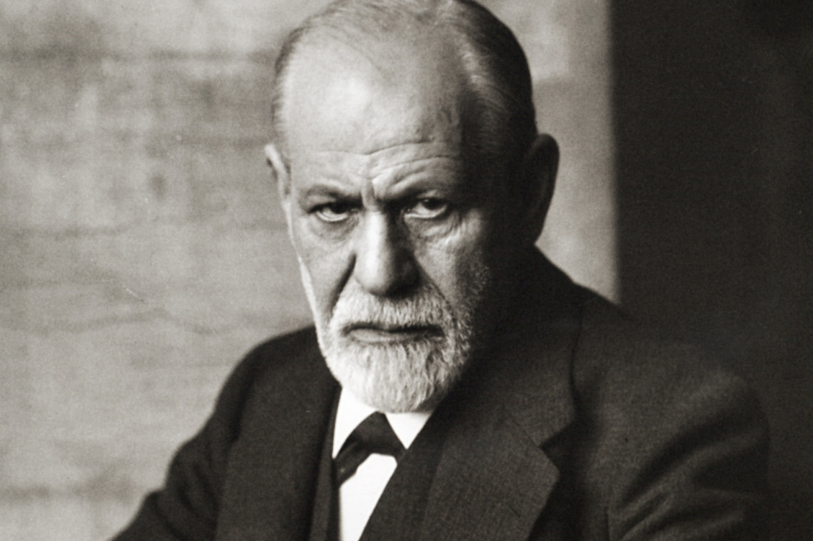
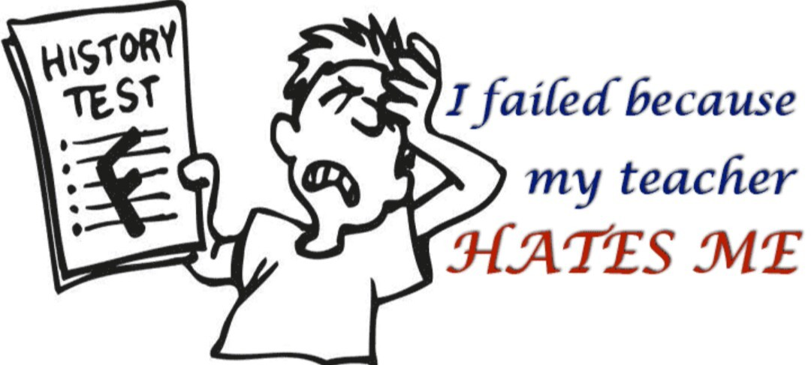

Để tự sỉ thành tự hào? Hãy gán cho chúng một cái tên
======================================================================

Văng “l…” “c…” “đ… mẹ” vào mặt các độc giả xa lạ liệu có phải hành động xấu không? Cho trâu húc nhau tàn độc rồi đứng reo hò tiêu khiển là xấu chăng? Tiêu tiền hoang phí, lười đọc bài dài, nghiện truyện tranh hóa dại v.v… có phải là đặc điểm xấu không?

Nếu bạn vội vàng trả lời có, hãy dừng lại đọc vài thông tin hy vọng khiến bạn suy nghĩ thoáng hơn.

> • Tục một chút mới là người **sống thật, sống thẳng** với lòng mình, không hoa mỹ giả tạo.
>
> • Ngày xưa ở vùng ven biển nọ, tương truyền có người trông thấy hai con trâu húc nhau, thấy động trâu liền chạy xuống biển. Người trong vùng truyền nhau ấy là trâu thần bèn tổ chức hội chọi hàng năm nhằm cầu mong biển êm sóng dịu. **Lễ** **h** **ội chọi trâu** mang tính chất tâm linh hướng đến sự bình an cho con người.
>
> • Có thể bạn chưa biết, ở Nhật có thuật ngữ **Tsundoku** dành cho những người thích mua sách nhưng chẳng bao giờ đọc.
>
> • **Too long; didn't read**, còn được viết tắt **TLDR**, thường được dùng trên internet dành cho những bài viết quá dài.
>
> • **Otaku** là thuật ngữ tiếng Nhật chỉ những người mê đắm manga, anime… một cách hơi quái dị.

Bạn đọc xong những giải thích trên và có thấy mức độ xấu của chúng được giảm đi không, nếu có thì tại sao, khi mà nó đâu thể thay đổi biểu hiện của những đặc điểm ấy? Phân tâm học của Signmund Freud gọi đó là cơ chế tự vệ _Hợp lý hóa_.

Nói một cách sơ bộ, học thuyết Phân tâm của Freud cho rằng nhân cách xây dựng trên 3 thành tố trọng yếu: Xung động bản năng, Bản ngã, Siêu ngã. Toàn bộ hành vi của con người bị chi phối bởi Vô thức, Tiền ý thức, Ý thức, trong đó Vô thức chiếm phần lớn gấp nhiều lần Ý thức.

Xung động bản năng là nguồn năng lượng mạnh mẽ nhất của tinh thần, nó là một cấu trúc _nguyên sơ, vô tổ chức, vô luận lý, bốc đồng_, tất cả hoạt động chỉ nhằm _thỏa mãn_ ham muốn bản năng, hiếu chiến và nhục dục. Siêu ngã là một tập hợp quy tắc ứng xử và đạo đức do xã hội đặt ra, là _lý tưởng_ và _lương tâm_, nhằm ngăn chặn Xung động bản năng gây hại cho xã hội. Và Bản ngã đứng ở giữa với nhiệm vụ _kiềm chế vừa phải, thỏa mãn hợp lý_ cho Xung động bản năng. Mâu thuẫn giữa Xung động bản năng và Bản ngã và Siêu ngã diễn ra liên tục.

Vô thức trồi lên xung đột với Ý thức tạo thành lo âu. Bản ngã đứng ở vị trí quân bình mong manh giữa Xung động bản năng và Siêu ngã, có nhiệm vụ giải quyết lo âu đó. Một trong những cách giải quyết của Bản ngã là _cơ chế tự vệ_. Tự vệ luôn có chung 2 đặc điểm: _hành động trong vô thức_, người dùng không cố ý và cũng không nhận ra mình dùng; và _bóp méo thực tại_ trong một chừng mực nhất định.

**Hợp lý hóa:** Cơ chế tự vệ này cố gắng giải thích những hành vi không thể chấp nhận được của chủ thể thành hành vi chấp nhận được dưới góc độ khác.

Cụ thể văng tục với người xa lạ là không chấp nhận được đối với Siêu ngã, cơ chế tự vệ cố gắng bào chữa bằng góc nhìn “thẳng thắn”, “sống thật” trong khi đó tồi tệ vẫn hoàn tồi tệ, chả giảm đi một ly.

Dù khoác lên danh từ nào thì: **Chọi trâu** là ngược đãi động vật, **Tsundoku** là hoang phí, **TLDR** là đọc kém đáng thương, **Otaku** là… thôi, bọn này hung hãn lắm. Nếu hôm nay bạn nói xấu chúng, ngày mai người ta sẽ tìm được chân và bụng bạn trong tủ lạnh nhà chúng, còn phần ở giữa thì không bao giờ được tìm thấy cả.

> Khi được nhắc nhở về thói hư tật xấu của từng thế hệ.
>
> 8x đáp: “Vâng, tôi biết, nhưng thói xấu thời nào chả có.”
>
> 9x đáp: **“Xấu c…! Đó là style của bọn tao.”**

Cơ chế này có tác hại khiến cho chủ thể không ý thức được mình tồi tệ như thế nào, thậm chí chủ thể còn tự hào về nó bên cạnh những kẻ cũng giống mình.

Do đâu mà Xung động bản năng xung đột với Siêu ngã mạnh mẽ đến vậy. Đó là ở môi trường sống, mọi hành động của những người xung quanh khi bạn thơ bé đều in dấu vào Vô thức: đó là chửi tục, là bạo lực, là tâm lý dễ tôn sùng. Trong khi đó lý tưởng ở Siêu ngã thì quá khác biệt.

Người ta dạy bạn về thuần phong mỹ tục nhưng truyền hình ra rả một lũ mông đùi hài bậy tục tĩu, người ta dạy nhau hạn chế bạo lực nhưng ra đường va quệt cũng giết nhau, người ta không muốn người trẻ cuồng thái quá nhưng chính lớp già thì tôn sùng lãnh tụ lên trên cả thánh. Hiển nhiên lúc này loạn trí là điều tất yếu dẫn đến.

Vậy nên để sống tử tế và lành mạnh trong một xã hội nhiều mâu thuẫn là khó khăn và thật cần lý tính tỉnh táo để phân biệt.

Dẫn chứng sau cùng, Hitler dùng cụm từ “Giải pháp cuối cùng” thay vì “diệt chủng”. Xưa kia là thế, bây giờ, ai mà biết được.

Tornad

