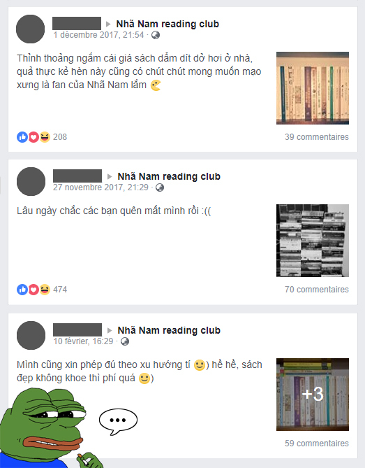
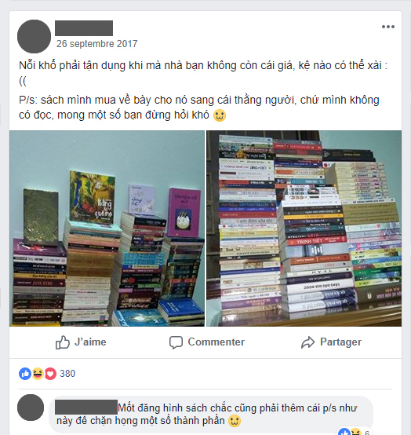
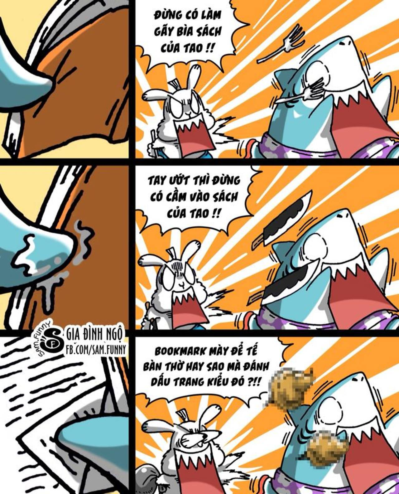

Khoe sách: Căn bệnh tâm thần bái vật
==============================================

Dù bạn mua sách để đọc hay chỉ để khoe, khoe sách vẫn là chuyện cá nhân bạn, và không chỉ riêng bạn mà rất rất nhiều người cũng khoe sách với lí do tự do cá nhân; do đó khoe sách là một việc tưởng rất đỗi vô hại.

Tuy nhiên, ẩn nấp đằng sau những hành động trên là những vấn đề đã rất cũ đối với triết học và tâm lí học. _Các triết gia quan ngại về vấn nạn này trước xã hội_; các tâm lí gia, trong chừng mực nhất định, gọi đó là _căn bệnh phá huỷ cuộc sống con người._

## I. Từ vô thức tập thể của dân Việt

Dân chúng Việt Nam trước nay không mấy gần gũi với sách.

Cổ sử cho chúng ta thấy số lượng người biết chữ chỉ tập trung vào một nhóm nhỏ chứ chưa bao giờ phổ cập toàn dân. Cận sử với mốc 1945 dân ta chiếm 95% mù chữ, mãi đến 2006 số lượng biết chữ mới lên được 95%. Trong số đó cũng hiếm người mặn mà với sách, vì theo một bài báo 2012 thì người Việt trung bình đọc một cuốn sách mỗi năm.

Dầu vậy, khái niệm sách vẫn tồn tại trong tâm thức người Việt: _Sách thánh hiền xưa kia học để thi cử làm quan, sách để học tập, sách để nghiên cứu, sách chứa điều hay._

Có thể thấy trong vô thức người Việt khái niệm **sách gắn liền với thứ gì đó cao sang**. Và chúng ta **không** bắt gặp ở những di sản để lại, như cổ tích hay sử liệu, trường hợp **đọc sách chỉ để giải trí, hay đơn giản là mục đích nào khác ngoài tri thức**.

Ngược lại, bằng chứng cho thấy người Việt trọng sách thì rất nhiều: Nói có sách, mách có chứng; Thuộc sách văn hay, mau tay tốt chữ; và các câu truyện nhờ sách mà thăng tiến như Lưu Bình - Dương Lễ.

> Định nghĩa: **Sách là phương tiện dùng để lưu trữ và chuyển tải kiến thức.**

Như vậy sách và kiến thức vốn là hai khái niệm tách biệt. Kiến thức có thứ tốt, có thứ độc hại, nhưng vô thức người Việt **mặc định sách là kiến thức tốt**. Một cách khéo léo hai khái niệm này bị đồng hoá với nhau như một mẫu số chung trong vô thức dân Việt.

Tôi mượn thuật ngữ của nhà Phân tâm học Carl Jung gọi là **vô thức tập thể**.

Và vô thức tập thể ở người Việt rằng sách không những **bị đồng hoá với kiến thức tốt mà sách còn lên tầm biểu tượng cho những gì cao quí** hơn bình thường.

## II. Đến bái vật hàng hoá

Triết gia Karl Marx trong bộ _Tư bản luận_ của mình ở ngay chương đầu tiên phân tích về hàng hoá, ông đã đưa ra khái niệm **bái vật hàng hoá**.

> Định nghĩa: **Bái vật lấy từ thuật ngữ bái vật giáo, một tín ngưỡng sơ khai, chỉ những đồ vật được con người gán cho những tính chất và quyền năng vốn không thuộc về đồ vật ấy.**

Marx chỉ ra trong xã hội tư bản sẽ đến lúc **con người giao tiếp với nhau qua hàng hoá thay vì cá nhân từng người**.

“ _Các sản phẩm của bộ óc con người thể hiện ra thành những sinh vật độc lập, có cuộc sống riêng của chúng, có những mối quan hệ nhất định với con người và giữa chúng với nhau._” \[trích\]

Một nhóm facebook chứa đầy kẻ bái vật

Các giá trị đảo điên: **(1) Vật tiêu dùng** chỉ mang lợi ích sử dụng biến thành hàng hoá và khoác lên mình giá trị xã hội riêng. **(2) Con người** không giao tiếp với nhau bằng cá nhân mình nữa mà bằng hàng hoá cá nhân làm ra. **(3) Và hàng hoá** thay vì là nô lệ của con người, chúng sẽ đảo ngược nô dịch lại chính con người.

**Cụ thể với sách.**

**1\. Nếu chỉ dừng lại là vật tiêu dùng** (để đọc), hiển nhiên một cuốn sách mới: giấy bền, chữ nét sẽ _mang giá trị cao hơn_ cuốn sách cũ thời 7x: giấy rách, ố vàng, chữ mờ.

Nhưng chuyện gì đã xảy ra, khi giá sách cũ nay đội lên trung bình 300k đến 900k VNĐ, ngoại lệ có những cuốn chục triệu. _Trong khi cùng một nội dung, phiên bản tái bản cuốn sách ấy chưa đến 100k VNĐ_.

Lúc này sách cũ không đơn thuần để “lưu trữ và chuyển tải kiến thức” như nhiệm vụ, mà đã được những kẻ bái vật gán thêm _giá trị về địa vị xã hội, và tính lịch sử_ vào cuốn sách.

**2\. Và cũng những giá trị ấy ở cuốn sách những kẻ bái vật lại tượng trưng cho bản thân người sở hữu là mình.** Lúc này họ chứng tỏ bản thân với người khác không bằng chính mình nữa, mà bằng cuốn sách cũ hiếm kia! Ai có được món hàng hiếm, kẻ ấy đáng gờm; ai có nhiều, kẻ ấy đáng trọng; và ai mua với giá khổng lồ, kẻ ấy địa vị xã hội cao. _Tất cả bằng hàng hoá và nhờ hàng hoá khoác lên mẽ ngoài._

Lúc này họ giao tiếp và chứng tỏ với nhau bằng độ hiếm, độ cũ, độ đắt, độ nhiều của sách mình có _thay vì phẩm chất cá nhân mình_.

**3\. Nếu cộng đồng đọc sách giao tiếp với nhau bằng những gì trí tuệ mình hiểu biết về sách**, thì cộng đồng khoe sách giao tiếp với nhau bằng ảnh chụp giá sách của mình, bằng số lượng sách mình có.

Thay vì đua nhau đọc hiểu sách, họ sẽ đua nhau mua sách mới, săn sách cũ điên cuồng. Ngoại trừ kẻ giàu mới nổi, số còn lại hiếm ai chi trả được cho những cuốn sách giá hàng triệu mà không rơi vào kiệt quệ (sẽ được nói thêm mục IV bên dưới).

Chính lúc này bái vật đã bắt đầu nô dịch con người.

Ảnh trên có thể thật, có thể trôn. Nhưng vẫn phản ánh chính xác vấn đề.

Marx cũng đã nói về cách thoát khỏi sự chi phối này. Nhưng đòi hỏi nền sản xuất hàng hoá phát triển cao như xã hội tư bản bây giờ, còn nước ta thì mới đang thời kì chuyển giao nên vấn nạn trước mắt của kẻ giàu mới nổi là khó tránh.

“ _Phải đợi đến khi có một nền sản xuất hàng hóa hoàn toàn phát triển thì mới có thể từ bản thân kinh nghiệm mà rút ra được một nhận thức khoa học là: các lao động tư nhân, được tiến hành một cách độc lập đối với nhau nhưng lại gắn liền với nhau về mọi mặt với tư cách là những khâu của sự phân công lao động xã hội tự phát, luôn luôn được quy thành thước đo xã hội của chúng một cách tỷ lệ._” \[trích\]

## III. Cho đến bái vật ở tâm lí học

> Định nghĩa: **Bái vật ở tâm lí học, hay ái vật, chỉ đến những người có hấp dẫn tính dục với đồ vật; chỉ cần được nhìn, cầm nắm, liếm mút đồ vật cũng mang đến khoái cảm cho họ.**

_(Các bạn khoe sách có biểu hiện này hay không, chỉ các bạn biết rõ, hãy trung thực với lòng mình.)_

Có nhiều lí giải nguyên nhân ái vật: **(1) Do thơ ấu** thiếu thốn đồ vật ấy mà sau này đồng hoá nó với ham muốn tính dục. **(2) Do lần đầu** động dục có liên quan đến đồ vật ấy. **(3) Thậm chí** theo Freud ái vật ở nam giới là bắt nguồn từ nỗi sợ bị thiến hoặc thấy người mẹ không có dương vật nên tưởng mẹ bị thiến (Freud không bàn về ái vật ở nữ giới).

Bệnh ái vật có thể xuất hiện ở bất cứ ai, giới thợ vẽ kiêm làm hề không ngoại lệ

**Bản thân tôi nghiêng về lí thuyết 1**, và lí thuyết này có thể lí giải trường hợp cuồng sách nhưng chưa đến mức ái vật. Và xin kết hợp Phân tâm học lí giải như sau:

    Những kẻ khoe sách mới nổi bây giờ, **mang mặc cảm thơ ấu đói sách vở, và mặc cảm thứ hai là họ không có khả năng hấp thụ được kiến thức trong sách**.

    Một mặt, **vô thức của họ có vết sẹo ham muốn sách, mặt khác vì không đủ khả năng, vô thức sử dụng cơ chế phòng vệ bù trừ.** Thay vì đọc hiểu sách (chất) họ sẽ bù trừ bằng số lượng sách (lượng), và thay vì đọc hiểu họ sẽ khoe sách để tự phong cho mình là người đọc sách, mình có tư cách đứng vào đội ngũ đọc sách.

## IV. Và căn bệnh tâm thần bái vật

Tựa đề bài này và tựa đề mục IV không hề nói quá, hãy trông ảnh.

Hình trên minh hoạ một trường hợp có thật của hai bệnh nhân, một nặng một nhẹ.

Và nếu mọi người còn nhớ năm 2014 có hai vụ việc: _Đạo diễn Lê Hoàng lấy sách kê chân ghế_ (và dư luận lên đồng phản đối); và _b_ _é gái ăn trộm sách bị đeo bảng Tôi là ăn trộm_ (và dư luận lên đồng bênh vực) ta sẽ thấy kha khá người trong xã hội này lệch lạc tâm lí.

Và bệnh tâm lí thì cần bác sĩ chữa thay vì lôi sách ra liếm láp đến khi mủn cả giấy.

**Tham khảo:**

_Tư bản luận,_ Quyển I –  Karl Marx, NXB Sự Thật, 1960

_Phân tâm học nhập môn_ – Sigmund Freud, Nguyễn Xuân Hiến dịch, NXB Đại học Quốc gia Hà Nội

Tiểu luận _Fetishism_(1927) – Sigmund Freud

_Thăm dò tiềm thức_ – Carl Jung, Vũ Đình Lưu dịch, NXB Tri thức, 2007

**Tornad**

8/7/2018

