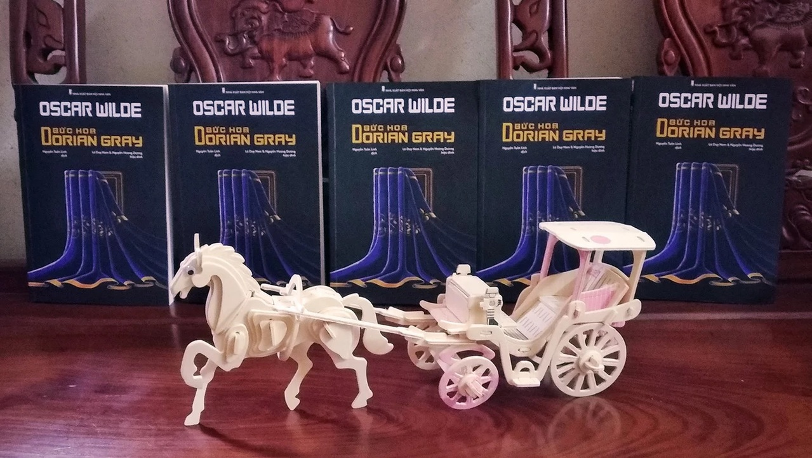

Kinh điển là gì, và nếu vậy, thì như thế nào?
============================================================

_Văn chương kinh điển là gì? Điều kiện nào để một cuốn sách trở thành kinh điển? Liệu cứ lâu đời là trở thành kinh điển? Liệu cứ khó đọc là trở thành kinh điển? Hay được giới chuyên môn khen ngợi thì thành kinh điển?_ Những câu hỏi này luôn mang một lớp sương khói mờ ảo, vậy nên ở bài viết này tôi sẽ trình bày một cách khách quan nhất kinh điển là gì và như thế nào.

Đầu tiên, đối tượng trong bài viết này chỉ nói về _văn chương kinh điển_, ở đôi chỗ được gọi tắt là _kinh điển_.

* * *

## I. KINH ĐIỂN LÀ GÌ

* * *

_Kinh điển_, từ nguyên xuất phát từ các ngôn ngữ Ấn-Âu: _classique_(Pháp), _classicus_(La Tinh), ban đầu mang nghĩa “thuộc về một tầng lớp”, về sau mang nghĩa rằng “thứ hạng cao của một tầng lớp”. Hiện nay, định nghĩa đầy đủ ta có về kinh điển là **“tác phẩm mang tính tiêu biểu, được làm chuẩn mực, tạo ra sức ảnh hưởng cho các tác phẩm khác cùng thể loại”**.

Như vậy, nói đến kinh điển là bao hàm trong nó một sự **so sánh**, mà so sánh luôn phải đặt cùng hệ quy chiếu. Giả dụ nhắc đến kinh điển _Sherlock Holmes_, ta phải mặc định đặt nó vào thể loại trinh thám, nó sẽ làm chuẩn mực, và có thể cả ảnh hưởng cho, ví dụ, _Hoa súng đen_. _Chúa tể những chiếc Nhẫn_ là kinh điển cho thể loại kỳ ảo, sẽ làm chuẩn mực và ảnh hưởng cho _Harry Potter_; chứ không thể so chiếu với thể loại khác. Tương tự, _Lolita_, _Roméo và Juliette_, _Frankenstein_… đều là kinh điển và ở các thể loại của riêng mình.

Và bởi 2 yếu tố: **tiêu biểu** và **ảnh hưởng**, mang tính so sánh, chúng ta cần phải có những cuốn khác cùng thể loại để so. Giả sử anh sáng tác một thể loại mới, ai đọc cũng thích sách của anh, nhưng anh chỉ được coi là kinh điển khi thể loại ấy đã có nhiều tác phẩm, và anh được so sánh đối chiếu với họ, để thấy là anh hơn và anh được làm chuẩn mực mà họ chịu ảnh hưởng. Trung bình sáng tác một cuốn sách phải mất hàng năm, để có nhiều cuốn sách so sánh phải đợi đến hàng chục năm; do đó, kinh điển thường là những cuốn sách ra đời đã lâu.

Tuy nhiên, là kinh điển (tiêu biểu và chuẩn mực) **không có nghĩa là cái gì cũng nhất**. Với độc giả ngày nay, có thể thấy _Sherlock Holmes_ có nhiều vụ án khá là dễ đoán, văn phong không hấp dẫn bằng các trinh thám sau này. Hoặc _Chúa tể những chiếc Nhẫn_ thiếu những nút thắt mở, tâm lý nhân vật một chiều. Hoặc _Frankenstein_ không đủ kinh dị.

Và kinh điển **càng không phải là hay nhất**, với độc giả, thậm chí ngay cả đối với tác giả. _Sherlock Holmes_ không nhận được tôn trọng từ chính Conan Doyle. Doyle viết _Holmes_ chỉ để kiếm tiền phục vụ cho ước mơ tiểu thuyết lịch sử, ông chưa bao giờ coi _Holmes_ là di sản để lại cho đời.

**Đối với độc giả, hay hoặc dở tùy vào thị hiếu.** Có thị hiếu đọc kinh điển, có thị hiếu đọc văn thị trường, có thị hiếu đọc văn giải trí. Hiển nhiên, với thị hiếu văn giải trí sẽ thấy _Hoa súng đen_ hay hơn _Bên phía nhà Swann_, với thị hiếu văn thị trường thì _Mắt biếc_ hay hơn _Bắt trẻ đồng xanh_. Vậy nên hay hoặc dở hoàn toàn là nhận định chủ quan, điều đó đáng được tôn trọng, nhưng không được coi là chân lý phổ quát.

* * *

## II. KINH ĐIỂN THÌ NHƯ THẾ NÀO?

* * *

_Vì sao cuốn này trở thành kinh điển, còn cuốn nọ thì không? Sách kinh điển hơn các sách khác như thế nào?_

#### 1\. Tính vượt thời gian

_Vượt thời gian_ (tạm dịch từ _timeless_) là tác phẩm mà dù đọc trong thời kỳ nào, tính từ hiện tại trở về quá khứ (bởi tương lai là thứ không bao giờ chúng ta có thể biết trước), người đọc đều có thể thấy giá trị nó mang lại vẫn còn to lớn cho ngày hôm nay. Nó khiến người ta **muốn đọc lại** nhiều lần, ở nhiều độ tuổi, và mỗi độ tuổi sẽ thấy một tầng ý nghĩa khác. Và do đó, nó chịu được sự đào thải của thời gian để tồn tại trong nhiều đời sau.

Cạnh đó, kinh điển là tác phẩm **không sợ bất cứ tác động nào e rằng có thể phá bỏ giá trị của nó**, kể cả khi tách nó khỏi bối cảnh sáng tác đi nữa. Kể từ khi ra đời, _Roméo và Juliette_ sau 400 năm vẫn gây xúc động sâu sắc về tình yêu và thù hận, nó không kém giá trị đi nếu chẳng may người đọc biết trước cuối truyện đôi tình nhân đều chết; họa chăng nó chỉ hết giá trị một khi loài người không còn tình yêu và thù hận trong cuộc sống nữa. Hay _Lolita_, đặc sắc ở cách viết văn bằng câu đố của tác giả, dù cho đã có riêng cuốn sách _Chú giải Lolita_ để độc giả dễ hiểu, thì trí tuệ vượt bậc của Nabokov vẫn khiến người đọc trầm trồ. Và không ngăn người ta đọc đi đọc lại.

Đối lập đó, là các tác phẩm đã **chết yểu ngay từ khi độc giả đọc xong lần đầu tiên**. Đó là những tác phẩm **giật gân, viết vòng vèo mong đánh lừa** người đọc ở trang cuối. Theo con đường này, sức sống của các tác phẩm ấy mong manh đến mức chỉ lỡ bị tiết lộ nội dung (spoil) thì tác phẩm coi như chết. _Ai còn muốn đọc thể loại trinh thám giật gân kinh dị nếu hung thủ và nút thắt đều đã bị lộ trước?_ Hay các tác phẩm viết theo trào lưu nhất thời, mà trong thời buổi công nghệ này chỉ cần vài tháng sau là lạc hậu, bị tách khỏi bối cảnh sáng tác, ta chỉ thấy nó kể chuyện sinh hoạt lặt vặt cùng những sự kiện nhảm nhí cho người đọc.

#### 2\. Nền móng và sức ảnh hưởng

Trước khi _Holmes_ ra đời, Edgar Allan Poe đã từng viết trinh thám, nhưng chỉ đến khi Conan Doyle đặt bút viết _Holmes_, thể loại trinh thám mới gây vang dội cho đến nay. Hay trước Tolkien, văn kỳ ảo chỉ là thể loại cho trẻ em và bị giới chuyên môn xếp ngoài rìa lãnh địa Văn Chương viết hoa, Lewis bạn ông với _Biên niên sử Narnia_ cũng chẳng khá hơn, chỉ cho đến khi _Chúa tể những chiếc Nhẫn_ ra đời, thể loại kỳ ảo mới nhận được sự để tâm của giới chuyên môn.

Có thể thấy các tác giả và tác phẩm trên **không phải được sinh ra đầu tiên** trong thể loại, nhưng bằng tài năng mình, họ nhanh chóng vươn lên hàng **tiêu biểu**, trở thành kinh điển.

Sau khi đã chiến thắng thời gian, theo lẽ tự nhiên, kinh điển đi vào tiềm thức các độc giả, tác giả non trẻ. Dù không cố ý, khi sáng tác họ vẫn ít nhiều chịu ảnh hưởng từ các tác giả đi trước. Một thành mười, mười thành trăm, có bao nhiêu tác phẩm chịu ảnh hưởng là bấy nhiêu chứng cớ khiến cho kinh điển của họ sống mãi.

#### 3\. Đánh giá từ giới chuyên môn

Dù muốn dù không, thị hiếu của đám đông là **khó lường và dễ điều khiển**, kinh điển dựa một phần vào đánh giá chủ quan của giới chuyên môn. Những người có đủ 3 nền tảng triết học, tôn giáo, nghệ thuật ngõ hầu tương đương với các tác giả kinh điển để cảm thụ tác phẩm của họ. Nếu cùng một cuốn kinh điển, một em bé đọc sẽ hiểu theo tầng nghĩa đầu tiên em hiểu được, một người trưởng thành theo tầng nghĩa thứ hai, và giới chuyên môn sẽ tìm tầng 3, 4, 5… nếu có, để đánh giá cuốn sách có xứng đáng hay không.

Tất nhiên, lịch sử cho thấy giới chuyên môn nhiều lần đã để sót các tác phẩm giá trị, nhưng các tác phẩm đã được họ chọn thì không cuốn nào là thấp kém cả.

Và chúng ta hẳn đều muốn lưu lại cho con em đời sau những cuốn sách có nhiều tầng nghĩa, cho nhiều độ tuổi; **hơn là cuốn sách chỉ có một lớp nghĩa duy nhất, để đọc chỉ một lần duy nhất, để sau này giới thiệu cho con em nghe thì chớ có… spoil.**

**Tornad**

_2/1/2018_

