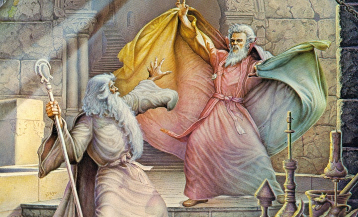
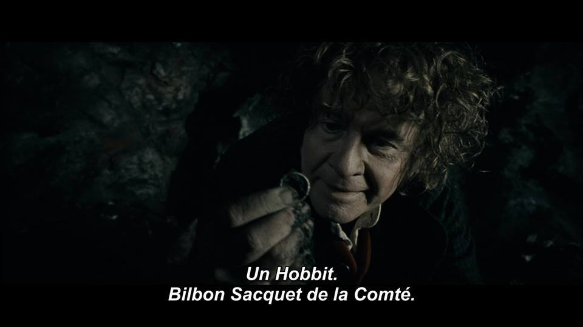

Peter Jackson đã phá hoại Chúa tể những chiếc Nhẫn của Tolkien như thế nào
==============================================================================================

> Họ moi tuột ruột sách, xào xáo thành bộ phim hành động cho lứa tuổi 15-25. Và e là Người Hobbit rồi cũng bị tương tự. Tolkien bị… ngấu nghiến bởi tính đại chúng và bị nuốt chửng trong trò lố bịch thời nay. Khoảng cách khổng lồ giữa cái đẹp và nghiêm trang của nguyên tác với thứ mà nó chuyển thể làm tôi không ngờ được. Thị trường hóa đến mức đã xóa trắng tầm vóc mỹ học và triết học của tác phẩm.
>
> Christopher Tolkien

Trên đây là bình luận của Christopher Tolkien, con trai thứ ba, người kế tục, biên tập và vẽ minh họa, người đóng góp nhiều nhất cho các tác phẩm của J. R. R. Tolkien.

Bộ phim của đạo diễn Peter Jackson đã quá nổi tiếng và trở nên quen thuộc với nhiều người, 11 giải Oscar trên 11 đề cử, đạo diễn Jackson đã cố gắng cân bằng yếu tố giải trí và tính trung thành với tác phẩm. Thế nhưng quan điểm “Cách tốt nhất để phá hoại văn chương là dựng phim nó” vẫn đúng trong trường hợp này.

Vẫn biết thay đổi cách thức truyền tải từ đọc sang nghe nhìn sẽ thất thoát tác phẩm đi nhiều, nên ở bài này, người viết sẽ chỉ kể đến những chi tiết quan trọng, mà sự sai lệch quá xa với sách, gây ảnh hưởng lớn trong suy nghĩ của người xem phim về bộ sách Nhẫn của Tolkien.

**Phim:** Là bộ phim hành động pha hài hước, điểm sáng ở những góc quay rộng lột tả vẻ hùng mạnh của các đạo quân và cảnh đẹp thiên nhiên, kỹ xảo tốt, diễn viên đẹp.

**Sách:** Là sử thi về cuộc Nhẫn chiến ở Kỷ Đệ Tam của Trung Địa. Tác phẩm tập trung tả cảnh, tả vẻ ngoài của từng nhân vật, tả lối sống, văn hóa và ngôn ngữ riêng (do nhà ngôn ngữ học Tolkien sáng tạo) của từng giống loài. Có khoảng 50 bài thơ trải đều tác phẩm.

**Bình:** Thời lượng phim không cho phép mang tất cả vùng đất và nhân vật lên màn ảnh, cách thức truyền tải bằng hình ảnh khó nói lên được phẩm chất của nhân vật, và do thị hiếu khán giả mà hầu hết thơ ca bị cắt bỏ. Bộ phim tập trung thể hiện nội dung tác phẩm qua các pha hành động. Do đó từ sử thi đậm tính văn chương, Chúa tể những chiếc Nhẫn trở thành phim hành động, tính mỹ học và triết học đều mất hết.

Truy cập link cuối bài để xem thêm về tinh thần tác phẩm. \[\*\]

## 1\. Frodo và Sam

**Phim:** Frodo là Người Mang Nhẫn nhưng rất mờ nhạt, cậu khá yếu đuối và dựa dẫm vào Gandalf, Sam. Cuối phim cậu đuổi Sam vì bị Gollum lừa. Sam dũng cảm, trung thành và tỉnh táo, cuối phim chú được miêu tả như anh hùng.

**Sách:** Frodo già hơn Sam, khi bắt đầu lên đường Frodo 50 tuổi, Sam 38 tuổi. Cậu tính tình trầm lặng, thích lang thang một mình, thích suy tư, giỏi tiếng Tiên, và được Tolkien miêu tả cao quý như một cậu Tiên con. Sam là người làm vườn của cậu, chú rất yêu quý cậu, mau nước mắt khi xúc động. Như mọi Hobbit bình thường, chú quê mùa, vui vẻ và ít học.

**Bình:** Sự cải biến của Frodo ở phim làm cho cậu trở nên bình thường trong đám người Hobbit thay vì là một chàng trai cao đẹp bị cả Quận gọi là gàn vì đã không quê mùa giống họ. Frodo không bao giờ la cà buôn chuyện trong quán bia ở Quận (mà nếu đọc sách ta biết đó là quán _Rồng Xanh_, còn gã hobbit chê cậu tên là Ted Sạn Mịn) như phần đầu phim.

Việc phá hủy chiếc Nhẫn trong phim trở thành phút bốc đồng của cậu thay vì mất hàng năm chuẩn bị như sách, đồng thời xóa đi lòng dũng cảm và tinh thần hy sinh của Frodo. Trong 4 hobbit của Hội Đồng Hành, Frodo là người duy nhất ngay từ đầu đã ý thức được chuyến đi này là để chết, không hy vọng trở về. Sam đi cùng bởi vì cậu chủ chú ở đâu thì chú ở đó mà thôi, chú không tuyệt vọng vì chú chưa nghĩ nổi đoạn cuối hành trình sẽ như thế nào. Merry và Pippin thậm chí còn hối hận vì đã đi.

Cạnh đó phim cũng làm mất sự thông thái của Frodo khi nghe lời Gollum mà đuổi Sam về, kịch bản rất… Đường Tăng và Bạch Cốt Tinh. Trong hành trình đi cùng Gollum, Frodo là người tỉnh táo nhất, cậu gần như đã phục thiện được cho Gollum bằng trí tuệ và lòng nhân hậu của mình. Và tình bạn của cậu với Sam dĩ nhiên không bao giờ bị chia cắt bởi một kẻ khét tiếng dối trá và nguy hiểm (Gollum).

## 2\. Gandalf và Saruman

Fun fact: Màu áo của Saruman trong truyện là Đa Sắc - Saruman of Many Colours - như hình chứ không trắng như phim.

**Phim:** Gandalf là lãnh đạo chính của phe thiện, ông phá bùa mê cho Théoden, thay Denethor chỉ huy Kinh Thành Minas Tirith, đánh thắng Balrog nhưng thất bại trước Saruman và khi đấu tay đôi với Chúa Nazgûl.

Saruman phản bội phe thiện, bí mật tạo dựng quân đội riêng. Là người ếm bùa lên Théoden. Là người ra lệnh đỉnh Caradhras nổi bão tuyết.

**Sách:** Cả Gandalf và Saruman là các Istari được gửi đến Trung Địa đối chọi với Sauron nhưng không được dùng sức mạnh nào ngoại trừ sự thông thái để giúp Con Người. Gandalf theo chính đạo còn Saruman theo đường tà vạy, lão thông thái hơn Gandalf và có khả năng thuyết phục kỳ tài..

**Bình:** Việc ngăn cấm Istari dùng bạo lực là tư tưởng rất đẹp của Tolkien, vì bạo lực chỉ sinh thêm bạo lực. Hơn nữa, vũ khí mạnh nhất của 2 phe đều là quyền lực mềm, bạo lực chỉ là việc của tầng lớp thấp kém.

Vậy nên phân đoạn Gandalf và Saruman giao đấu là cải biến tai hại. Saruman cũng không ếm bùa lên Théoden. Trong sách Théoden bị Lưỡi Giun – kẻ bị Saruman mua chuộc, nói lời tuyệt vọng làm nhụt chí. Đó là quyền lực mềm chứ không có bùa phép nào cả. Saruman cũng không có quyền năng ra lệnh cho thời tiết. Không sinh vật nào ở Trung Địa có được quyền năng này. Sức mạnh của lão là sự thông thái và khả năng thuyết phục lòng người.

Do Saruman không dùng phép thuật nên Gandalf cũng không dùng phép hóa giải nào. Cuộc đụng độ với Chúa Nazgûl trong sách không có, nhưng cho dù có thì Chúa Nazgûl cũng không làm gì được ông bởi Gandalf quyền năng ngang hàng với Sauron (và Balrog, kẻ vừa bại trận) và dĩ nhiên Chúa Nazgûl không thể hủy trượng của ông được.

## 3\. Aragorn và Elrond.

**Phim:** Aragorn thuộc dòng trực hệ Elendil, là người kế thừa hợp pháp ngôi vua Gondor, nhưng anh không nhận nó vì sợ mình sa ngã trước chiếc Nhẫn như tổ tiên xưa. Thanh Kiếm Gãy gia truyền để lại ở Thung Đáy Khe. Trước trận Đồng Pelennor, anh vào Lối Người Chết tìm cứu viện từ hồn ma Những Kẻ Bội Ước khi tình hình đang tuyệt vọng.

Elrond Á Tiên chủ nhân Thung Đáy Khe, ông dùng óc thông thái giúp Con Người chống lại Sauron, nhưng rất phản đối tình yêu Người-Tiên giữa Aragorn và Arwen con gái ông.

**Sách:** Aragorn vô cùng tự hào về dòng dõi mình, và anh đủ tự tin biết rằng mình không sa ngã trước Nhẫn, mơ ước cả đời anh là tiêu diệt Sauron và lên ngôi vua. Thanh Kiếm Gãy luôn mang bên mình. Anh cùng toán người Dúnedain vào Lối Người Chết với mong muốn đi đường tắt sớm đến Minas Tirith.

Elrond vị Chúa của cả Người và Tiên luôn hậu thuẫn cho anh đạt được ước mơ, ông và anh thỏa thuận rằng Aragorn chỉ tính chuyện gia thất một khi đã làm vua Gondor.

**Bình:** Sự tư ti trong phim làm mất đi lý tưởng cao đẹp của Aragorn. Với lòng kiêu hãnh của người Dúnedain thuần chủng khó có chuyện anh làm ngơ ngôi vị khi mà Quốc quản Gondor hiện giờ thuộc chủng Người thấp kém hơn nhiều. Hơn nữa thật kỳ quặc khi anh day dứt vì một lỗi lầm không phải của mình đã xảy ra gần 3000 năm trước.

Ở Lối Người Chết, anh không hy vọng nhiều vào Đội Quân Bội Ước vì họ là hồn ma không chiến đấu được. Anh chỉ muốn đi nhanh để tự mình ứng cứu cho Minas Tirith. Vận may mỉm cười khi Vua Người Chết đi theo lời hiệu triệu và toán cướp biển Umbar thấy cảnh đó, chúng sợ hãi bỏ chạy. Aragorn đi tiếp, Đội Quân Người Chết nay tròn ước thì tan biến. Họ không tham chiến trên đồng Pelennor như phim.

Trong phim, khi đứng trước Cổng Đen, Aragorn nóng giận chặt đầu tên sứ giả. Giết sứ giả là cấm kỵ trong chiến tranh, một vị vua Gondor không bao giờ làm vậy cả.

        Elrond, bằng mọi cách để ngăn duyên con mình, ông đã không nói về tương lai Aragorn có con với Arwen, ngay cả việc rèn lại Thanh Kiếm Gãy cũng do Arwen yêu cầu và ông giúp đỡ Aragorn khá miễn cưỡng. Tóm lại, từ một vị Chúa của cả Tiên và Người nhân từ và thông thái, bộ phim hạ ông xuống thành người cha ích kỷ hạ tiện, ngăn duyên cấm phận rất Châu Á.

Cạnh đó, trong trận Hẻm Helm, Elrond phái Haldir tiếp viện. Điều này là không thể vì Haldir thuộc địa phận Lóriel, do Galadriel, mẹ vợ Elrond, cai quản. Lúc này ở tất cả vùng đất đều có chiến tranh, người tiên ở Trung Địa còn rất ít, họ không thể đi trợ giúp. Vả lại, Tolkien muốn ngầm nói Kỷ Đệ Tam là thời kỳ cho Con Người tỏa sáng.

## 4\. Ent

**Phim:** Tộc người cổ xưa sống trong rừng Fangorn, được Merry và Pippin vô tình đánh thức. Cây Râu là người đầu tiên, ông đánh thức số còn lại để lập Ent hội. Ent hội quyết định không tham gia Nhẫn chiến vì không liên quan đến mình. Nhưng sau khi thấy Orc đốt phá Fangorn, họ bất thần tham chiến. Ent là tộc người khá buồn cười.

**Sách:** Ent là tộc đầu tiên xuất hiện ở Trung Địa, trước cả Tiên. Cuộc đời dài lâu tích lũy nhiều tri thức, ngay đến Saruman cũng phải nhờ họ chỉ dạy. Ent hội quyết định tham chiến, đánh vào Isengard. Và họ không buồn cười chút nào.

**Bình:** Người Ent trong phim quá cục bộ không tương xứng với sự thông tuệ họ có được. Ngôi nhà Fangorn bị tàn phá mà chủ nhà cũng không biết thì thật lạ lùng. Yếu tố hài ban đầu là Merry, Pippin, rồi đến Gimli, nhưng lôi cả Ent vào thì đúng là "trò lố bịch thời nay".

## 5\. Faramir

**Phim:** Là em trai, và là cái bóng của Boromir. Chàng yêu quý cha mình nhưng không được hồi đáp, nên sau khi Boromir chết chàng cố gắng tuyệt vọng mong được cha yêu thương. Chàng tra tấn Gollum để lấy tin, bắt cóc Frodo về Osligiath để dâng Nhẫn cho cha, nhưng phút cuối hiểu chuyện đã thả cậu đi.

**Sách:** Faramir trông giống Boromir đến ngạc nhiên, nhưng tâm hồn ngược lại hoàn toàn. Chàng có đủ dũng cảm và cương quyết trong trận mạc, nhưng chàng yêu thơ ca tích truyện hơn, ở chàng hội tụ đủ văn võ và vẻ cao quý của các vua xa xưa mà Aragorn đôi khi để lộ. Faramir yêu quý cha nhưng từ nhỏ đã không theo đường binh đao như cha mong muốn. Chàng sáng suốt để không theo vết xe đổ của Boromir. Faramir thả Frodo ra ngay cùng với lương thực tặng và lời chúc. Chàng thậm chí không làm đau một con thú hoang nếu không cần thiết.

**Bình:** Giống với Frodo, Faramir là nhân vật cao đẹp nhưng bị dìm không thương tiếc. Ở thời chiến chẳng khó khăn gì để thấy các chiến binh can trường như Boromir, nhưng để tìm một vị Chúa hội tụ đủ văn võ như Faramir thì rất hiếm. Tolkien muốn nhấn mạnh điểm này, nhưng Jackson thì ngược lại, vị đạo diễn thậm chí để cho Faramir dùng nhục hình moi thông tin từ Gollum. Tra tấn tù binh là chuyện một người lính Gondor cũng không làm, chưa nói đến một vị Chúa tôn quý.

## 6\. Théoden

**Phim:** Vua Rohan, trở nên nhu nhược vì Saruman nhập hồn, sau được Gandalf hóa giải thì một lần nữa làm minh quân. Sau chiến thắng Hẻm Helm ông đã từng không muốn tiếp viện cho Minas Tirith vì Gondor đã không giúp ông ở Helm. Ông hy sinh trên đồng Pelennor.

**Sách:** Théoden bị Lưỡi Giun làm nhụt chí, Gandalf đến đuổi Lưỡi Giun đi (xem 2). Sau chiến thắng Hẻm Helm ông ngay lập tức đến Gondor mà không nghỉ ngơi. Ông hy sinh trên đồng Pelennor.

**Bình:** Đúng là Gondor không cử quân trợ giúp Rohan, nhưng bởi vì chiến tranh lan mọi miền đất, và Minas Tirith là nơi gánh nhiều tai ương nhất. Ngọn tháp trắng Minas Tirith đứng đối mặt trực tiếp với ngọn tháp phù thủy Minas Morgul. Minas Tirith là tấm khiên, một khi tấm khiên vỡ, bóng tối sẽ mặc sức xổ ra không gì cản bước được. Gondor cần bảo vệ bằng toàn lực, chỉ có miền đất khác cần cử quân bảo vệ nó, không có chuyện ngược lại. Đó là vấn đề thứ nhất.

Vấn đề thứ hai, tình bạn thiêng liêng của Gondor và Rohan đã trải qua nhiều đời. Tổ tiên Théoden từng thề sẽ sẵn sàng trợ giúp Gondor bất cứ khi nào họ cần. Théoden không bao giờ vừa bội nghĩa vừa ngu ngốc mà nghĩ đến chuyện bỏ mặc Gondor cả. Đối với Rohan, bảo vệ Gondor cũng nghĩa là bảo vệ chính mình.

## 1\. Cuộc ghé thăm Tom Bombadil

Đây là đoạn không có trong phim.

Trên quãng đường từ Quận đến Bree, nhóm 4 cậu Hobbit đã hai lần gặp tai nạn, hẳn các cậu đã chết nếu không được Tom cứu cả hai lần. Tom Bombadil là một lão già, tính tình vui nhộn, nhảy múa và ca hát luôn miệng. Lão sống trong Rừng Cổ với nàng Anh Đào Vàng con gái Dòng Sông.

Cuộc gặp gỡ Tom không ảnh hưởng nhiều đến nội dung về sau. Tom tồn tại như một biểu tượng về cái thiện vĩ đại đến mức cái ác không xâm hại được. Không ai hại được Tom nhưng Tom cũng không hại được ai. Ngụ ý của Tolkien ở đoạn này là giữa hiểm nguy lớn thì cái thiện vẫn sinh sống được, như là bài học đầu tiên cho 4 cậu hobbit bước vào hành trình.

## 2\. Cuộc thanh tẩy Quận

Đây là đoạn không có trong phim.

Saruman sau khi thất thủ Isengard, bị Gandalf hủy trượng, lão bỏ đi lang thang với Lưỡi Giun, quyền phép lão mất nhưng sự thông thái và khả năng thuyết phục vẫn còn. Lão đi đến Quận, mê hoặc đám Người xấu xa làm tay sai cho lão, bằng bạo lực và trí óc họ dễ dàng trấn áp được đám dân Quận nhỏ bé, ngốc nghếch.

Bây giờ là lúc cho 4 cậu Hobbit sử dụng khả năng của chính mình sau khi được cuộc Nhẫn chiến tôi luyện, Gandalf đã bỏ đi trước đó để đến gặp Tom nói chuyện dông dài. 4 cậu Hobbit nhanh chóng dẹp loạn, Saruman và Lưỡi Giun chết, đến lúc này Nhẫn chiến mới chính thức kết thúc, tại Đáy Bao, cũng là nơi bắt đầu hành trình.

Nơi kết thúc cũng là nơi bắt đầu, thủ pháp nghệ thuật (mà tôi tạm quên tên) này không lạ lẫm. Ngay trong Chúa Nhẫn bạn cũng sẽ nhận ra: Nơi tạo Nhẫn cũng là nơi hủy Nhẫn (Đỉnh Định Mệnh), người bắt đầu cũng là người khép lại (Gollum). Tạo thành một vòng tròn luân hồi.

Vậy là đó là những ý chính cơ hồ giải đáp tại sao cụ Christopher đã nói Peter Jackson phá hoại tác phẩm của cha mình.

Minh họa cho bài viết link dưới. Trong hình là phụ đề Pháp, ngay cả phim mà người Pháp cũng dịch tên đầy đủ và cẩn thận không thua gì sách. Trong khi nhiều người Việt cứ gân cổ không muốn dịch.

Tornad

