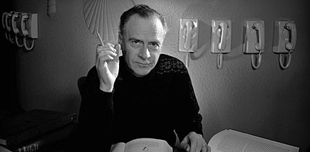
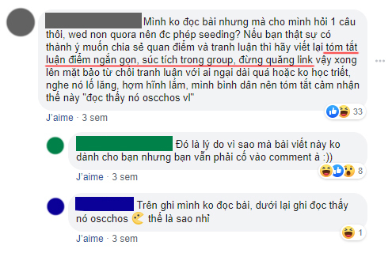
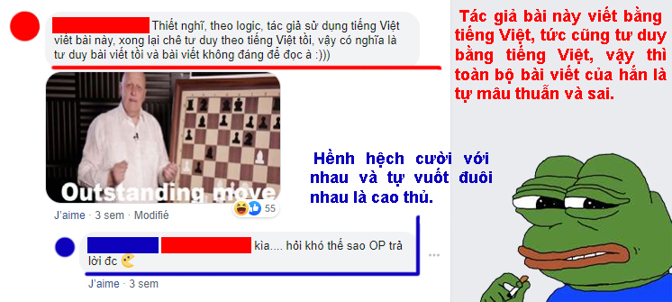
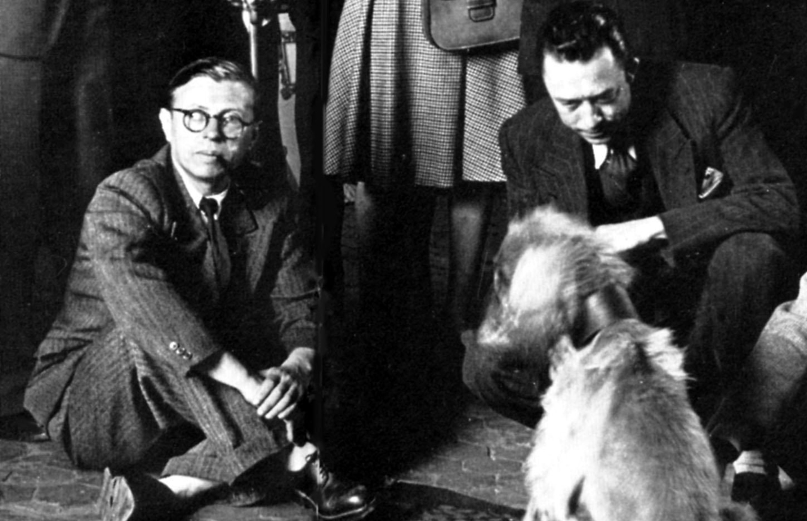

Phi nhân hoá: Vì một thế giới mạng tươi đẹp hơn!
=================================================================

Quả thật thời gian như bóng câu qua mành, mới đó mà đã một tháng trôi qua kể từ bài viết _Nếu không muốn tư duy tồi thì đừng tư duy theo tiếng Việt_ (link cuối bài). Bài ấy thu hút nhiều xiết bao ý kiến, người khen cũng nhiều, kẻ chê không ít, và giữa rừng người ta không khó nhận ra đâu đây một sở thú mi-ni, nơi vượn hót như máy, gà gáy liên hồi, lừa tự nhồi đầu vào rọ, và nhện nhọ đã kịp thời ra phim mới.

Nhân tiện nói về Nhện Nhọ làm tôi nhận ra viết bài gây bão cũng giống như làm phim siêu anh hùng các bạn ạ. Quanh quẩn một số mô-típ và phong cách nhất định, các phần liên quan nhau được nhá trước bằng after-credits, thế nhưng khán giả không bao giờ chán, khen cũng xem mà chửi cũng xem. Cũng như việc hễ tôi viết bài là luôn xuất hiện vài nhân vật chê bai bải cả trước mặt lẫn sau lưng nhưng vẫn đọc không sót bài nào vậy.

Hưởng ứng tinh thần đó, chủ đề bài này viết về cách… **cứu thế giới**, cụ thể là thế giới mạng; với **phần đầu cho người đọc thấy bản chất của thế giới mạng là như thế nào và thái độ nên có trước nó**. Phần hai sử dụng cái… **after-credits** của bài _Nếu không muốn tư duy tồi thì đừng tư duy theo tiếng Việt_ để cùng thấy **cư dân mạng mang bản chất như thế nào, và làm sao để việc lên mạng vui như thể bước vào một thế giới đầy tình thương mến thương**, bất chấp những tiếng đcm, ncl, ccc, v.v.

* * *

## I. PHƯƠNG TIỆN LÀ THÔNG ĐIỆP

* * *

Marshall McLuhan là triết gia người Canada, nếu sống vào quãng năm 1960 ở Mĩ hiếm ai lại chưa từng nghe tên ông. Xuất thân từ một học giả nghiên cứu văn chương, nhưng triết gia này lại nổi tiếng nhờ triết lí và tiên báo về truyền thông của mình. Ông là người đưa ra thuật ngữ _làng toàn cầu_, là tiên báo cho mạng internet ngay từ những năm 60. Quyển sách nổi tiếng nhất của ông nhan đề _Understanding Media: The Extensions of Man_ (Hiểu về phương tiện: Phụ kiện của loài người) sẽ giúp chúng ta nhìn ra nhiều thứ về bản chất thế giới mạng.

Do mê văn chương nên trong 400 trang sách McLuhan rất thích dẫn từ Shakespeare, James Joyce cho đến William Blake; câu nói tạo nên danh hiệu ông cũng mang đầy tính văn chương như thế: **The medium is the message**. Tuy nhiên vì nhìn nhận quyển sách như một triết luận nên tôi sẽ dịch sát nghĩa nhất có thể và tạm bỏ đi phần hình thức: **Phương tiện là thông điệp**. Đây chính là tên chương đầu tiên trong cuốn Understanding Media, và chúng ta cần hiểu nó trước.

Ảnh: Eudaimonia

Phương tiện, tức phương tiện truyền thông, là những cái xe, cái vỏ để chở và chứa thông điệp. Thông điệp là phần nội dung mà phương tiện chở đến cho ta, tỉ dụ bài viết là thông điệp mà phương tiện Spiderum chở đến cho người đọc. _Chúng ta thường tưởng rằng chỉ thông điệp là thứ ta tiếp nhận vào đầu thôi, phương tiện chỉ là phụ, dù Spiderum chở hay Facebook chở đều không quan trọng._

Nhưng McLuhan cho rằng chính **phương tiện là thứ tái cấu trúc xã hội con người, nó tạo mới và chi phối hoạt động con người, nó làm thay đổi mối quan hệ giữa người với người**; chính là do phương tiện, không phải do thông điệp. McLuhan còn cho rằng phương tiện là thứ phụ kiện lắp vào cơ thể con người, tàu hoả là cái chân bằng máy thần tốc lắp vào cơ thể người, đèn điện là đôi mắt bằng máy tinh tường lắp vào cơ thể người. Một khi các cơ quan trong cơ thể được thay đổi thì cách con người sống cũng thay đổi theo, tất yếu là phải như vậy.

Tàu hoả là phương tiện chở thông điệp là hàng hoá và con người, giúp đi nhanh hơn, xa hơn, nhưng chính tàu hoả kéo theo sự ra đời của những công việc mới, cách giải trí mới, thành phố kiểu mới. Đến khi máy bay ra đời thì lại một lần nữa xã hội người tái cấu trúc, nhiều tuyến đường tàu dần bị dẹp bỏ. Đó là những thay đổi không đừng được khi con người gắn lên mình những phụ kiện mới.

Marshall McLuhan

**Đây cũng là lí do mà tôi luôn cười ngán ngẩm khi thấy những người miệng xuýt xoa mình học được cái này cái nọ nhiều lắm từ QuoraVN, hay RedditVN, hay những thứ tương tự như vậy trên Facebook.** Về cơ bản đó là một ảo tưởng, ảo tưởng độc hại, nhưng tôi không có tham vọng giải ảo cho những kẻ đã u mê, bài này dành cho những người tỉnh táo.

Trước hết ta hãy phân tích trên lí thuyết xem phương tiện Facebook có đặc điểm gì. **Facebook là mạng xã hội, nơi bất kì ai cũng đăng kí được**, từ giáo sư tiến sĩ đáng kính, đến thằng học sinh cá biệt 10 môn viết vào 1 quyển vở, đạo đức tồi, học rất ngu, tất nhiên. **Nơi lúc nào cũng có nhiều người, có nhiều biến để hóng. Và đặc biệt là nơi mọi người tìm đến để chơi,** bạn có thể phủ nhận điều này, nhưng nghĩ kĩ xem. Bạn có học ở Facebook như đúng nghĩa, tức là phải ghi ra vở ôn đến khi nhớ thì thôi, hay là bạn chỉ vào Facebook để cười, nhân tiện gặp tí kiến thức thì đeo lên trang trí, rồi lỡ tuần sau quên hết thì cũng chả sao?

**Facebook tái cấu trúc khiến người dùng luôn sống vội.** Bảng tin ở Facebook làm mới liên tục, hàng trăm bạn bè đăng tin mỗi ngày, do đó mỗi tin buộc phải ngắn thì người khác mới đọc, tin buộc phải thu hút bình luận thì mới không trôi. Do đó bình luận phải dễ viết thì mới thu hút được nhiều, thực tế thậm chí không cần viết, người ta bình luận bằng ảnh chế. Và bọn cặn bã thì luôn nhiều hơn người tử tế, thay vì nói lí, chúng chửi nhau. Một nơi bát nháo.

Ảnh lấy từ QRVN

Và các nhóm Facebook cũng là nơi bát nháo không hơn không kém.

QuoraVN, tôi mang QRVN làm ví dụ chứ không có ý nói nó bát nháo nhất, nó chỉ là điển hình của sự bát nháo nhưng ảo tưởng học thuật cũng ngang với RedditVN vậy (dĩ nhiên điều này không đồng nghĩa tôi tự nhận bài viết của tôi là học thuật).

Mặc dù phải ghi nhận rằng các BQT của QRVN đều là người tử tế và đường hướng 4T (Tử tế - Tôn trọng) của họ dành cho nhóm là tốt đẹp, sự bát nháo hoàn toàn không phải lỗi do họ. Thực tế bát nháo là điều không tránh được ở Facebook vì đó là lối sống mà Facebook đã tái cấu trúc cho người dùng của nó, bởi suy cho cùng nhóm QRVN vẫn thuộc về Facebook mà thôi.

Hình minh hoạ bên trên chính là một trong nhiều lí do tôi **không bao giờ viết cái gì dài và nghiêm túc trên Facebook** cả. Tôi dùng Facebook để chơi và không ảo tưởng là để học, còn một khi muốn đăng cái gì dài và đầu tư lên Facebook, tôi chọn cách đăng vào một phương tiện khác và dẫn link đến Facebook mà thôi.

Việc này buộc người đọc muốn đọc phải nhảy sang một phương tiện khác thì mới tiếp cận được với thông điệp, và một khi tiếp xúc với phương tiện khác thì ít nhiều người đọc được rũ bỏ cái lối sống ở Facebook (mà tôi cho là độc hại) trước khi thu nhận thông điệp vào đầu. Tuy nhiên như ảnh trên các bạn đã thấy, việc cố giúp con khỉ bỏ khu rừng ra khỏi đầu không phải lúc nào cũng thành công, bởi Facebook đã cấu trúc đầu óc người đọc rằng chỉ đọc những thứ ngắn gọn và ác cảm với việc dẫn link.

Ngoài ra, đến ảnh này thì còn cho thấy một bi kịch khác mà phương tiện Facebook đã cấu trúc cho người dùng, đó là **nó khiến người dùng luôn bình luận một cách úp mở, bóng gió chứ không bao giờ rõ ràng, và luôn ngắn tủn mủn**, tất nhiên.

Chương 2 quyển _Understanding Media_ mang tên Media Hot and Cold, nơi McLuhan trình bày lí thuyết của ông về hai loại phương tiện: nóng và lạnh.

**Phương tiện nóng** là những thứ mang độ nét cao, tức những thứ chứa thông điệp rõ ràng, rành mạch. Đứng trước phương tiện nóng người thưởng thức cần rất ít tương tác. Ví dụ như sách, phim, đài, những thứ tương tác một chiều với khán giả. Khán giả chỉ cần tập trung thưởng thức và toàn bộ thông điệp sẽ bộc lộ mà không cần tương tác lại.

**Phương tiện lạnh** thì ngược lại, nó mang độ nét thấp, tức chứa thông điệp mơ hồ và không hoàn chỉnh. Khán giả bắt buộc phải tương tác thì thông điệp mới dần hé lộ đến hoàn chỉnh, ví dụ cho trường hợp này là cuộc trò chuyện nhiều người, trò chơi truyền hình, những loại sách thị trường tuỳ xem có bán chạy hay không mà tác giả mới sáng tác tiếp.

Khỏi phải nói chúng ta đã thấy phương tiện lạnh là thứ áp đảo trên Facebook, lượt tương tác là thứ khiến BQT các trang và nhóm Facebook phát rồ lên. Nhưng họ không có lựa chọn bởi ít tương tác đồng nghĩa với chìm và chết, Facebook là vậy. Tất nhiên người dùng Facebook càng không có lựa chọn, họ như bầy giôm-bi tương tác khắp nơi như lên cơn thèm ăn não. Và thứ văn hoá nói bóng gió, lập lờ từ đó sinh ra.

Hãy thử nhìn vào cư dân mạng mười năm trước thôi, cái thời mô hình diễn đàn còn thịnh hành, nơi mỗi thớt đều có chủ đề riêng và BQT giám sát, những dạng bình luận như trên ảnh kia sẽ bị coi là spam và bị xử lí ngay rồi, thành viên cũng có trách nhiệm hơn chứ không vô lối như mạng xã hội bây giờ.

> Theo quyển Understanding Media, vào 17/1/1950 Giáo hoàng Pius XII đã lo ngại phát biểu rằng:
>
> “Có thể nói không ngoa rằng tương lai của xã hội hiện đại cùng sự ổn định của đời sống nhân dân phụ thuộc hầu hết vào cán cân giữa một bên là sức mạnh truyền thông và bên kia là phản ứng của người xem.”

Câu nói trên của Giáo hoàng quả thật không ngoa. Chúng ta sống trong xã hội mà phương tiện và thông điệp ở mọi nơi, oái oăm thay, cũng theo McLuhan thì **thông điệp của bất kì phương tiện nào lại cũng là một phương tiện khác.** Điều này đòi hỏi rất nhiều ở khả năng của mỗi cá nhân, bởi không dễ để tránh bị phương tiện đánh lừa khi mà phương tiện ở mọi nơi.

Chẳng hạn, Spiderum là phương tiện cho bài viết của Tornad, bài viết lúc này là thông điệp, nhưng nó cũng là phương tiện. Bài viết là phương tiện cho giọng văn của Tornad. Giọng văn lại là phương tiện cho tư duy của Tornad. Và có rất nhiều người đánh đồng giữa bài viết hoặc giọng văn vào tư duy khi thấy cái tít và văn phong sốc là đã vội qui chụp vào tư duy.

Người ngu dốt thì bị dắt mũi. Người khôn ngoan thì không bị thao túng và điều khiển. Nhưng kẻ ngu luôn nhiều hơn người khôn, và người khôn nên làm gì trước bầy đàn đồng loại bị giật dây và rất hung hăng?

* * *

## II. VÌ TẤT CẢ, HÃY PHI NHÂN HOÁ!

* * *

#### 1\. Phép thử đầy giá trị

Giờ đã đến lúc tôi dùng đến phép thử ở bài trước. Có thể nói là trong toàn bộ bài viết dài ấy, phần tôi thích nhất lại là phần ngăn ngắn ít quan trọng ở cuối bài. Vâng, đó là phần IV. CHẶN HỌNG, nội dung của nó như sau:

> Thật ra mục này đáng lẽ sẽ không cần đến mà bản thân tôi cũng không muốn viết, nhưng do bài này dài hơn hẳn các bài tôi viết trước kia, trong khi các bài trước kia thôi mà đã có nhiều người dài quá không đọc, cứ phản bác trước để tỏ ra ta đây cũng biết tranh luận, trong khi chẳng biết chút gì về qui luật luận lí cả, nên thôi bài này tôi viết để chặn trước.
>
> **Tham gia cuộc chơi mà không chơi theo luật thì cũng lố bịch như thể chơi cờ vua mà cho tốt nhảy luôn từ hàng 2 đến hàng 8 để ăn luôn vua đối phương vậy, rồi hềnh hệch cười với nhau và tự vuốt đuôi nhau là cao thủ.** Nó lố bịch đến mức cười cũng là sai.
>
> Nếu các dòng dưới có trùng với suy nghĩ của ai thì tức là suy nghĩ đó đã sai, và vui lòng không cần phải bình luận.
>
> — Tác giả bài này ghét tiếng Việt, viết bài này để dìm tiếng Việt.
>
> — Tác giả bài này cho rằng các thứ tiếng châu Âu là toàn hảo.
>
> **— Tác giả bài này viết bằng tiếng Việt, tức cũng tư duy bằng tiếng Việt, vậy thì toàn bộ bài viết của hắn là tự mâu thuẫn và sai.**
>
> — Tôi là người Việt tư duy bằng tiếng Việt mà vẫn hiểu những câu tiếng tây kia bình thường, vậy tức là tác giả sai.
>
> — Nhìn Nhật, Hàn, Trung họ cũng có ngôn ngữ giống tiếng Việt mà họ lí luận tốt kia kìa.
>
> — Bài này chỉ lôi những mặt xấu của tiếng Việt ra nói nên không khách quan.

Tôi thích nhất bởi đơn giản vì nó đúng, đúng theo lí thuyết tôi đưa ra và đúng cả khi đối chiếu với thực tế sau đó.

**Điểm thứ nhất:** Sở dĩ tôi viết ra mục ấy vì cảm thấy cách viết của mình dễ khiến người đọc rơi vào một vài nguỵ luận nhất định, thật ra nguỵ luận thì có cả trăm nghìn dạng, nhưng tôi nhặt ra những phương án dễ gặp nhất để thể hiện rằng “Những kiểu phản bác đó người viết đã tự nghĩ đến để bác chính mình rồi, và đều là nguỵ luận thôi. Người viết đã biết trước và đã xử lí rồi nên không cần bình vào nữa cho mất thời gian.”

Hai thanh niên này đớp chính xác vào hai miếng mồi tôi ném ra trước đó

**Điểm thứ hai:** Mặc dù đã viết vậy rồi nhưng tôi tin là nó sẽ không xi-nhê gì với một bộ phận lớn người đọc. Tức là mặc cho những gì chặn họng, một bộ phận người vẫn cứ nhào đến và **gáy lên như một cái máy** những âm thanh tôi đã tiên báo. Niềm tin này đã thành sự thật, trông ảnh trên.

**Điểm thứ ba:** Bài của tôi được bố trí sẽ đăng hai nơi là Spiderum và Facebook. Tôi đồ rằng Spiderum sẽ văn minh hơn Facebook, cả hai đều có những cái máy vào gáy nhưng Spiderum sẽ ít hơn. Điều này cũng lại đúng, tất nhiên.

Thật ra ban đầu tôi đã hơi lo âu vì thành viên Spiderum bình luận… văn minh hơn tôi nghĩ, vậy há chẳng phải tôi đã sai? Nhưng may mắn là giữa đàn cò trắng tôi kịp tìm ra một con **cò ghẻ** như trên (mấy thanh niên nói xấu tôi ở bài người khác coi như không tính đến), vậy là mọi chuyện vận hành ổn thoả.

Nhìn chung mấy thành phần đó tôi đều không trả lời, nguyên tắc của tôi là những nhân vật tôi chưa coi là người thì tôi sẽ từ chối giao tiếp.

#### 2\. Vì sao không phải là người?

Hai ví dụ dưới đây sẽ cho chúng ta thấy rõ câu trả lời.

Câu chuyện về ông bố.

> Phúc vừa về nhà thì bị bố mắng té tát. Ông bố giận dữ đến mức không để cho Phúc thanh minh câu nào. Nghe mắng xong Phúc về phòng suy nghĩ, bố cậu là người rất mực thước, ông chưa bao giờ mắng mỏ vô cớ, chắc hẳn cậu đã phạm tội tày đình nào rồi. **Phúc suy nghĩ trằn trọc đêm đó và sáng mai chỉ có hỏi bố tận nơi mới khiến cậu yên tâm được.**

Câu chuyện về con Vàng.

> Hôm nay Phúc về nhà bằng đường khác và bất chợt ngang qua cổng nhà lạ. Nhà đó có chó rất dữ, nó sủa và nhe nanh gầm gừ lộ rõ vẻ hung tợn của loài thú ăn thịt, may mà cổng đóng nên Phúc vội vàng chạy qua an toàn. Về nhà cậu cười xoà và tự nhủ ngày mai sẽ đi đường cũ. **Cậu quên chuyện con Vàng rất nhanh.**

Ta có điểm giống nhau trong hai câu chuyện trên, đó là Phúc đều bị thực thể khác xúc phạm vô cớ. Điểm khác nhau là với ông bố Phúc rất dằn vặt vì sợ mình đã sai gì mà không biết, còn với con Vàng cậu chẳng dằn vặt mảy may.

Vấn đề cốt lõi của việc này chính là nằm ở sự kì vọng của Phúc. Ông bố trong Phúc là một người mẫu mực, cậu đặt kì vọng vào khả năng phán xét của ông, nên bất kì động thái phán xét nào của ông Phúc đều coi trọng và không dám đoán mò. Còn con Vàng với Phúc chỉ là một con chó, cậu hiểu rõ lí do nó sủa cậu vì đơn giản cậu là sinh vật lạ bén mảng đến lãnh thổ nó tự cho là của nó, và vì nó chỉ cư xử theo bản năng nên cũng không hi vọng ngồi lại khuyên nhủ nó đừng làm vậy với người khác được. Phúc hiểu đó là lí do duy nhất và hiểu con Vàng **không có lựa chọn**, nên cậu không giận nó cũng không giận mình, cuộc sống cứ thế êm đềm.

Và cách hành xử của Phúc với con Vàng chính xác là những gì tôi muốn mọi người hành xử với một số thành phần. Ở trên tôi đã bôi đậm sự **không có lựa chọn** của con Vàng, và đây, lựa chọn chính là điểm phân biệt giữa những con người đúng nghĩa và những kẻ chưa sống được cho ra người. Nói cách khác, họ là loài người theo các nhà sinh học, nhưng theo các nhà triết học họ chưa biết cách sống cho ra người. Họ là những thứ mà Jean-Paul Sartre dùng từ "buồn nôn", còn Albert Camus dùng từ "phi lí".

Sartre và Camus, và một con chó

Triết học hiện sinh – trường phái triết học lấy con người làm trung tâm – có hai ý niệm chủ yếu mà bất kì con người nào cũng cần phải ý thức được.

**Thứ nhất là chủ thể tính:** triết hiện sinh cho rằng con người không chỉ như một vật trong vũ trụ, mà phải cao hơn thế. Sự vật thì luôn luôn phản ứng theo một cách nhất định, nhưng con người thì có thể lựa chọn để phản ứng theo ý chí tự do, bởi con người có lí trí, biết phản tư, biết tư duy. Con chó gặp sinh vật lạ, bản năng sẽ khiến nó căng thẳng và nó sẽ sủa đuổi đi. Con người gặp sinh vật lạ, bản năng cũng khiến y căng thẳng nhưng y có khả năng lựa chọn theo ý chí tự do chứ không theo bản năng, y có thể ra mời người lạ rời đi, hoặc làm quen họ, hoặc cứ thế bắn chết họ luôn, nhưng miễn đó là hành động xuất phát từ lựa chọn tự do thì y vẫn là con người.

**Thứ hai là tự do tính:** tức là con người lựa chọn việc mình làm theo ý chí tự do. Làm tự do là làm không vì gì khác ngoài ý chí của tôi, đồng thời tôi chịu trách nhiệm về việc mình làm, và tôi biết mình đang làm gì, làm tự do rất khác với làm tuỳ tiện ở đó. Xét ví dụ trên, dù người kia không nói không rằng xách súng ra bắn luôn người lạ, nhìn từ bên ngoài thì thật giống con chó xồ ra cắn bậy, nhưng một khi họ biết họ làm gì, họ chịu trách nhiệm về mình, thì họ vẫn là người, dù có thể là người ác.

Liên quan đến tự do tính lại có lắm lắt léo, giả dụ tôi dùng ý chí tự do của tôi để tự tước bỏ đi tự do tính của tôi. Tức là con người đúng nghĩa có thể vứt bỏ đi cái tự do của mình. Đến đây thì nền móng triết học hiện sinh có nguy cơ sụp đổ. Vậy nên các nhà hiện sinh mới nói làm người bắt buộc phải lựa chọn theo ý chí tự do, nếu anh vứt mất, anh thôi làm người.

#### 3\. Và những kẻ chưa được làm người

Những phần tử như trên và những phần tử tương tự về cơ bản không nên coi là người, bởi thực tế họ chưa được làm người đúng nghĩa. Bởi đầu tiên họ không có chủ thể tính, họ phản ứng như máy và theo cách đã được đoán trước. Còn giả như họ lựa chọn làm vậy thì đó không phải lựa chọn tự do, đó là hành động tuỳ tiện cho thoả bản năng và bất chấp qui tắc của một cuộc tranh luận.

Mà qui tắc tranh luận đã được tôi khéo léo cài vào phần giới thiệu 4 qui luật luận lí của bài ấy và kết hợp cả mục chặn họng cuối bài. Không những thế, khi chia sẻ qua Facebook cũng đã ghi một lần nữa, **tổng cộng là 3 lần. Nhưng đều vô hiệu.**

Nói tóm lại, nếu bạn từng có lần cảm thấy buồn bã vì bị các thành phần lâu nhâu chửi rủa trên mạng, hay thậm chí là để đối phó với vấn nạn cyberbullying, thì **phi nhân hoá là phương thuốc vàng cho bạn**. Thậm chí còn hiệu quả hơn cách tìm và xiên từng người qua mạng nữa, bởi bạn không thể xiên hết cư dân mạng được.

Nên thay vì bực tức khi lướt mạng, tại sao chúng ta không thử một lần coi họ không phải là người. **Bởi điểm trớ trêu của tạo hoá là khi không còn là đồng loại với nhau, ta sống vui vẻ với nhau hơn.** Quả thật, phi nhân hoá, ít nhất khi trên mạng, là việc rất nên làm.

* * *

## III. TỔNG KẾT

* * *

Viết bài gây bão cũng giống như làm phim siêu anh hùng vậy các bạn ạ. Khen nhiều, chê nhiều, mô-típ cũ, nhưng vẫn không ngớt người xem.

Facebook chưa bao giờ và không bao giờ là nơi để làm những chuyện nghiêm túc như tranh luận đúng qui luật luận lí hay học tập gì đó.

Có nhiều thành phần xét theo nhiều lí thuyết thì chưa sống cho ra người đúng nghĩa, vậy chỉ cần phi nhân hoá họ để thấy đời tươi đẹp hơn.

* * *

## IV. CHẶN H…

* * *

À mà thôi…

* * *

#### Tham khảo:

Understanding Media: The Extensions of Man. Marshall McLuhan.

Triết học hiện sinh. Trần Thái Đỉnh.

* * *

**TORNAD**

5/7/2019

