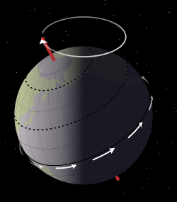
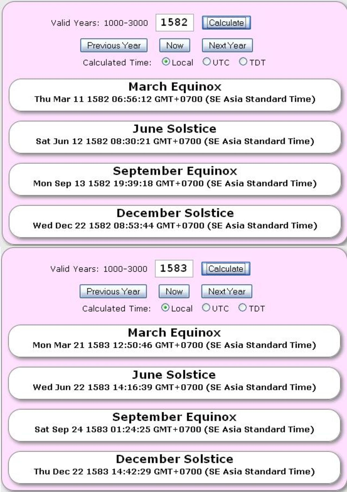

Sự phản khoa học của chiêm tinh học
==============================================

Trong một bài viết trước đây, tôi đã có dịp nói về sự khác nhau cơ bản giữa thiên văn học và chiêm tinh học. Gần đây, do có một số ý kiến tranh luận về một bài viết không chính thức của tôi về quan điểm liên quan tới chiêm tinh học, tôi xin có một số phân tích chi tiết để bảo vệ quan điểm của mình về sự phản khoa học của chiêm tinh học.

## Đôi lời ngoài lề của tác giả:

_Tháng 7 năm 2012, tôi có viết một note trên mạng xã hội Facebook với tiêu đề "Chiêm tinh học và những thằng ngu" với nội dung thể hiện thẳng thắn quan điểm của mình về sự thiếu cơ sở của chiêm tinh học dưới góc nhìn khoa học ngày nay, cũng như qua đó lên án kịch liệt các tổ chức, các nhóm sử dụng những thông tin bịa đặt và phản khoa học để lôi kéo người ủng hộ, đầu độc dân trí của lớp trẻ. Bài viết đã nhận được khá nhiều phản hồi cả tích cực cả tiêu cực từ người đọc, hầu hết là những người bạn của tôi._

_Một năm sau, tới tháng 8 năm 2013 một số website đã đề nghị sử dụng bài viết của tôi để đăng cho độc giả của các website khác đọc tham khảo. Việc này dẫn tới số lượng phản hồi về bài viết của tôi tăng lên khá nhiều. Điều đáng tiếc là đại đa số những người phản hồi cả đồng tình lẫn phản bác đều quên mất một điều như trên đã nêu: bài viết là một note cá nhân trên mạng xã hội, không phải phân tích chi tiết dưới dạng một lập luận chính thức. Đồng thời, tôi cũng nhận được khá nhiều câu hỏi của những người quan tâm đề nghị giải đáp và thảo luận về các nội dung đã nêu._

_Vì những lí do này, tôi đặt tay viết bài viết này, để phân tích chi tiết và cụ thể hơn cho các độc giả có quan tâm, cũng như một lần nữa thể hiện quan điểm khoa học của bản thân cũng như của tổ chức chúng tôi (VACA)._

_Và như tiêu đề của phần in nghiêng này tôi đã nói đây là"Đôi lời ngoài lề", vì vậy tôi cùng các đồng nghiệp của mình xin phép sẽ chỉ trả lời các hỏi đáp và phản biện liên quan tới phần chính của bài phía dưới đây._

* * *

**Đọc thêm:**

* * *

## Cơ sở chính của chiêm tinh học

Cơ sở chính của chiêm tinh học (Astrology) là căn cứ vào vị trí biểu kiến của Mặt Trời trên bầu trời trong một năm. Hàng nghìn năm trước, loài người chưa biết rằng Trái Đất chuyển động quanh Mặt Trời, chuyển động của Mặt Trời và các thiên thể khi đó được mô tả dưới góc nhìn chủ quan. Theo góc nhìn này, Mặt Trời di chuyển trên bầu trời theo một đường tròn khép kín bao quanh Trái Đất gọi là đường Hoàng đạo (ecliptic). Trên và dưới (hay Bắc và Nam) đường Hoàng đạo này người ta lấy mỗi bên mở rộng ra 8 độ tạo thành một dải gọi là vòng hoàng đạo (hay hoàng đới - zodiac). Theo cách phân chia các chòm sao trước đây thì có 12 chòm sao nằm trên dải này, vì thế chúng được gọi là các chòm sao Hoàng đạo.

Các nhà thiên văn và chiêm tinh học cổ chia dải này ra thành 12 phần bằng nhau, mỗi phần là một cung rộng 30 độ, gọi là các cung Hoàng đạo (zodiac sign), mỗi cung ứng với một trong số 12 chòm sao Hoàng đạo. Mỗi cung Hoàng đạo ứng với một khoảng thời gian khoảng một tháng trong năm mà Mặt Trời nằm ở vị trí của chòm sao đó khi nhìn từ Trái Đất. Cách phân chia kết hợp với quan sát vào thời gian đó (khoảng hơn 2000 đến 3000 năm trước) cho ra kết quả vị trí của Mặt Trời trong năm như sau:

Aries  21/03 – 19/04

Taurus  20/04 - 20/05

Gemini  21/05 – 21/06

Cancer 22/06 – 22/07

Leo 23/07 – 22/08

Virgo 23/08 – 22/09

Libra 23/09 – 23/10

Scorpius 24/10 – 21/11

Sagittarius 22/11 – 21/12

Capricornus  22/12 – 19/01

Aquarius 20/01 – 18/02

Pisces 19/02 – 20/03

Theo đó người sinh ra trong khoảng thời gian nào thì sẽ ứng với cung Hoàng đạo đó. Nhà chiêm tinh sẽ lập lá số cho người đó theo cung Hoàng đạo như vậy, kết hợp với ngày giờ chi tiết liên quan tới sự có mặt của Mặt Trăng và các hành tinh (khi đó có 5 hành tinh quan sát được là Sao Thủy, Sao Kim, Sao Hỏa, Sao Mộc và Sao Thổ) ở các vị trí tương ứng khác nhau mà ra kết quả lá số khác nhau.

Chẳng hạn: theo cách tính này, tôi sinh ngày 12/03 tương ứng với ngay trung tâm của cung Pisces. Ngoài ra tất nhiên còn nhiều yếu tố liên quan tới vị trí của các hành tinh ảnh hưởng tới lá số của tôi nữa.

## Dao động của trục quay Trái Đất

Chúng ta đã biết Trái Đất tự quay theo trục Bắc Nam với độ lệch là khoảng 23,5 độ so với trục vuông góc với Hoàng đạo. Tuy nhiên thực tế là bản thân trục này không phải cố định mà vì hiệu ứng hấp dẫn gây ra chủ yếu từ Mặt Trăng mà trục quay này có hiện tượng dao động với đường đi vẽ nên một hình nón. Đây gọi là hiện tượng tiến động (hay tuế sai - precession).

_Trục Trái Đất dao động vẽ nên dạng hình nón. Nguồn hình ảnh: Wikipedia_

* * *

**Đọc thêm:**

* * *

Hiện tượng này gây ra việc hướng của trục quay Trái Đất so với nền trời sao thay đổi, đồng nghĩa với việc hướng nhìn các chòm sao từ Trái Đất trong cùng khoảng thời gian tương ứng cũng thay đổi đáng kể, trong đó có góc nhìn các chòm sao Hoàng Đạo. Như vậy vẫn với 12 chòm sao Hoàng đạo như vậy nhưng khoảng thời gian tương ứng mà Mặt Trời đi qua chúng đã không còn như cũ.

Hai điểm lưu ý khác ở đây:

\- Kích thước của 12 chòm sao Hoàng đạo này vốn không bằng nhau, thời gian Mặt Trời lướt qua chúng không hề bằng nhau như cách chia của chiêm tinh học.

\- Vào đầu thế kỉ 20, với cách phân chia lại của Tổ chức thiên văn học quốc tế thì có một chòm sao thứ 13 đã có một phần trên vòng hoàng đạo, đó là chòm sao Ophiuchus.

Vì tất cả những lí do này nên ngày nay, vị trí tương ứng của Mặt Trời lướt qua 13 chòm sao này được tính tương đối chính xác như sau:

Aries               19/04 - 13/05

Taurus             14/05 - 19/06

Gemini             20/06 - 20/07

Cancer             21/07 - 09/08

Leo                  10/08 - 15/09

Virgo                16/09 - 30/10

Libra                31/10 - 22/11

Scorpius          23/11 - 29/11

Ophiuchus       30/11 - 17/12

Sagittarius       18/12 - 18/01

Capricornus     19/01 – 15/02

Aquarius          16/02 – 11/03

Pisces             12/03 – 18/04

Theo sự dịch chuyển này thì với ngày sinh của mình tôi lại nằm ở giữa Aquarius và Pisces.

Tôi đã nhận được một số phản hồi với nội dung rằng người ta không quan tâm tới sự dịch chuyển trên mà chỉ hiểu đơn giản rằng 12 cung Hoàng đạo vốn là một qui ước, và vì vậy nó cố định bất chấp sự thay đổi vị trí của các chòm sao. Điều tương tự cũng được bắt gặp ở nhiều website và diễn đàn về chiêm tinh học trên thế giới.

Tuy nhiên, dưới góc nhìn của tôi, đây là cách là môt hình thức ngụy biện hết sức thiếu thuyết phục. Ban đầu khi chưa có sự ra đời của mô hình nhật tâm Copernicus và phương pháp thực nghiệm do Galilei mở đầu thì các nhà thiên văn và các nhà chiêm tinh là như nhau. Việc họ đặt ra các chòm sao, rồi chia các cung vốn để xác lập những qui ước một cách logic để gọi và liên kết các yếu tố có thật của tự nhiên. Và với niềm tin khi đó, họ cho rằng những yếu tố đó ảnh hưởng trực tiếp tới đời sống con người (tất nhiên xét theo một số khía cạnh thì đến tận bây giờ, lập luận đó vẫn đúng). Nếu như một qui ước không phải để mô tả một thực tế mà chỉ là do con người tự đặt ra thì nó chẳng còn ý nghĩa gì cả, hay đúng hơn là vô giá trị. Nếu bạn lí luận rằng các cung Hoàng đạo chỉ là qui ước rồi sau đó lại nói nó có tác động lên cuộc sống con người thì thay vì vậy có lẽ bạn có thể tự lập hệ thống mới để làm sao lá số may mắn luôn rơi vào bạn cũng được chứ còn cần gì xem lá số của những người khác lập ra?

Đó, tất nhiên, là lập luận logic của bản thân tôi đối với lí lẽ cá nhân của một số người. Còn dưới đây, lại xin quay lại với các nhà chiêm tinh ngày nay.

* * *

**Đọc thêm:**

* * *

## Thiếu sót của các lập luận

Chiêm tinh học chúng ta đang nói ở đây là chiêm tinh học phương Tây dựa trên cơ sở của 12 chòm sao Hoàng đạo. Trong khi những nhóm quan điểm xem chiêm tinh dựa trên năm sao (sidereal year) không thể phủ nhận sự thay đổi của các lá số do trên thực tế chiêm tinh học của họ gắn liền với vị trí của Mặt Trời so với nền trời sao thì nhóm quan điểm phổ biến ngày nay sử dụng năm nhiệt đới (tropical year) để tính lá số không công nhận điều này.

Chiêm tinh học sử dụng năm nhiệt đới có nghĩa là các nhà chiêm tinh không cần quan tâm tới vị trí của các chòm sao thay đổi ra sao hay không, hay thậm chí kích thước chúng có khác nhau cũng không quan trọng. Theo lí luận của họ thì 12 cung Hoàng đạo của họ không chia theo các chòm sao mà chỉ lấy tên 12 chòm sao đặt cho 12 cung, còn thật ra thì khoảng chia mỗi cung 30 độ là chia ra từ khoảng cách giữa hai lần hai lần chí hoặc hai lần phân (chẳng hạn khoảng cách giữa hai lần xuân phân liên tiếp). Vì cách phân chia này nên cho dù các chòm sao có thay đổi thì độ dài của năm nhiệt đới vẫn không thay đổi (về cơ bản đây là chu kì thời tiết).

Lập luận này thoạt nghe rất có lí. Và chắc chắn những người tin tưởng vào chiêm tinh học rất hài lòng khi biết tới cách giải thích này. Tuy nhiên ở đây nảy sinh một thiếu sót mà các nhà chiêm tinh hiện đại đã quên mất khi đưa ra cách giải thích này.

Dương lịch ngày nay chúng ta sử dụng là lịch Gregorian được hoàn chỉnh từ lịch Julian do Julius Caesar ban hành. Sự đính chính này được thực hiện vào năm 1582 khi người ta nhận ra rằng chu kì của Trái Đất chuyển động quanh Mặt Trời không phải là 365,25 ngày như cách tính của lịch Julian mà là 365,2425 ngày. Sự thay đổi này về cơ bản chỉ là xác lập lại cách tính năm nhuận dương lịch (những năm nào có ngày 29 cho tháng 2) cho chính xác hơn.

Điều tôi muốn nói ở đây, là sự thay đổi này dẫn tới sai khác đáng kể khi tính lại các khoảng thời gian trong lịch Julian trước đó. Năm 1582 ngày xuân phân (ở Bắc bán cầu) rơi vào ngày 11 tháng 3, nhưng ngay năm sau là 1583 thì xuân phân lại là ngày 21 tháng 3 và tới ngày nay xuân phân vẫn tiếp tục rơi vào ngày này (đôi khi lệch sang ngày 20) vì quĩ đạo của Trái Đất đã được tính toán đúng.

_Sự khác nhau của các ngày phân và chí giữa năm 1582 và 1583 do thay đổi qui ước của lịch. Ảnh chụp từ website Stellafane.org._

Theo trường phái chiêm tinh này, thì ngày Mặt Trời bắt đầu đi vào cung Aries là ngày xuân phân, như ngày nay chúng ta thấy là ngày 20 hoặc 21 tháng 3 (tùy tài liệu có sai số khác nhau). Ấy thế nhưng trong quá khứ, từ năm 1582 trở về trước thì ngày xuân phân lại không như vậy mà đã từng là những ngày khác. Vậy phải có ít nhất một trong hai hệ thống tính toán trước hoặc sau năm 1582 là sai.

Nếu các lá số được sử dụng trước năm 1582 là đúng, thì có nghĩa các lá số được lập lại là sai khi thay đổi qui ước theo qui ước mới của lịch. Ngược lại, nếu các lá số trước 1582 là sai, có nghĩa là không có cơ sở cụ thể cho khả năng tiên đoán của toàn bộ môn chiêm tinh học, và hiển nhiên các lá số sau năm 1582 như ngày nay các nhà chiêm tinh đang dùng là không đáng tin cậy.

## Nghiên cứu và khảo sát khoa học bác bỏ chiêm tinh học

Dưới đây xin trích ra vài nghiên cứu điển hình của các nhà khoa học thế giới để điều tra độ chính xác của chiêm tinh học.

\- Tiến sĩ Geoffrey Dean - nhà khoa học và thậm chí từng là một nhà chiêm tinh ở Úc, cùng Ivan Kelly - một nhà tâm lý học Canada đã lấy số liệu theo dõi hơn 2000 người của một nghiên cứu y học tại London với mục đích ban đầu là theo dõi tình trạng sức khỏe ảnh hưởng do hoàn cảnh sinh sản. Hơn 2000 người này sinh năm 1958 và tất cả đều chỉ sinh ra trong cùng khoảng thời gian cách nhau một vài phút, có nghĩa là theo chiêm tinh học thì họ phải có lá số rất giống nhau. Qua theo dõi mọi đặc tính gồm tính cách, nghề nghiệp, tình trạng hôn nhân, quan hệ xã hội, chỉ số thông minh, các nhà nghiên cứu không tìm ra bất cứ điểm tương đồng nào chiếm ưu thế ở 2000 con người này mặc dù các nhà chiêm tinh khẳng định trước đó rằng họ phải có lá số giống nhau. (Nguồn: Telegraph.co.uk)

\- Shawn Carlson - nhầ vật lý tại phòng thí nghiệm Lawrence Berkeley đã đề nghị 26 nhà chiêm tinh được coi là rất có uy tín phát biểu suy đoán của họ về 265 người được cung cấp đầy đủ các thông tin cần thiết. Kết quả họ chỉ nói đúng khoảng 1 phần 3. Xét theo một khía cạnh nào đó, con số này không phải quá nhỏ, nhưng vẫn chỉ nói lên rằng đó là tỷ lệ của may rủi.

\- Tiến sĩ Bernie Silverman ở đại học Michigan làm một khảo sát bằng cách xem hồ sơ đăng kí kết hôn của 2978 cặp và 478 hồ sơ li hôn. Ông so sánh với kết quả phán đoán theo chiêm tinh học và kết quả là trong số các cặp li hôn, số cặp được chiêm tinh coi là hòa hợp li hôn nhiều cũng ngang với các cặp không có biểu hiện gì đặc biệt hay thậm chí bị coi là xung khắc . (Nguồn: Truthmagazine.com)

## Hiệu ứng Forer

Hiệu ứng này do nhà tâm lý học Bertram R. Forer bắt đầu nghiên cứu vào năm 1948 có liên quan tới việc xem chiêm tinh, tử vi, tướng số của con người. Nó giải thích tại sao một tỷ lệ rất lớn người ta thường cho rằng những gì mà chiêm tinh, tử vi ... đưa ra là đúng với mình.

Forer đưa cho nhiều sinh viên có ngày sinh rất khác nhau (tương ứng với lá số chiêm tinh khác nhau) cùng một nội dung chính xác (đã dịch ra tiếng Việt) như phía dưới và yêu cầu họ cho điểm về độ chính xác mà họ cảm thấy với bản thân mình.

_"Bạn có nhu cầu rất lớn về việc mọi người thích và ngưỡng mộ bạn. Bạn có xu hướng quan trọng hóa bản thân mình. Bạn có nhiều khả năng không được sử dụng để tạo thế mạnh cho mình. Khi bạn có vài cá tính yếu thì bạn thường lấp liếm cho nó. Các yếu tố về giới tính gây ra vấn đề cho bạn. Bề ngoài rất kỉ luật và biết kiểm soát bản thân, nhưng thực chất bạn luôn lo lắng và cảm thấy không an toàn. Bạn hay tự hỏi mình có quyết định đúng hay đã làm đúng không. Bạn thích sự thay đổi nhất định và không hài lóng vưới những giới hạn. Bạn tự hào rằng mình là một người suy nghĩ độc lập và không chấp nhận những ý kiến không có bằng chứng xác đáng. Bạn cho rằng quá thẳng thắn bôc lộ mình với những người khác là điều không khôn ngoan. Nhiều lúc bạn rất hướng ngoại, niềm nở, hòa đồng trong khi lúc khác lại hướng nội, thận trọng , dè dặt. Một số mong muốn của bạn rất không thực tế. An toàn là một trong những mục tiêu chính của bạn."_

Kết quả trung bình điểm mà các sinh viên này đánh giá là 4,26/5. Điều đó cho thấy có một lượng lớn các phát biểu mà luôn đúng với đám đông hay ít ra là đúng với tâm lý của họ tự nghĩ về mình.

Thí nghiệm này được lặp lại nhiều lần và gần đây là năm 2011 nó được áp dụng không còn cho cá nhân mà cho các tổ chức, và kết quả cũng tương tự.

(Nội dung hiệu ứng này được tham khảo tại Wikipedia (En))

## Dưới góc nhìn của giáo dục và xã hội

Với những phân tích và bằng chứng nêu trên, tôi nghĩ mình không cần thêm bất cứ lí lẽ nào khác nữa.

Giờ đây tôi xin quay lại với mục đích của mình như đã nêu ở đầu bài viết. Tôi đã nhận được nhiều ý kiến phản hồi cho rằng việc người dân hàng ngày xem và truyền miệng những câu chuyện về chiêm tinh chỉ là vui, là vô thưởng vô phạt.

Về một khía cạnh nào đó, tôi đồng ý với ý kiến này. Tuy vậy khi cái vô thưởng vô phạt, mà lại là cái vốn sai lệch, phản khoa học được truyền miệng không phải một vài lần mà là hàng ngày, hàng giờ; không chỉ ở các quán nước ven đường, các dòng tâm sự trên mạng xã hội mà đến các báo điện tử, các website nhận mình là khoa học cũng đưa lên thì nó không còn là "vô thưởng vô phạt" nữa, mà nó gây ảnh hưởng vô cùng trầm trọng tới nhận thức xã hội, nhất là với lớp trẻ. hãy tưởng tượng một xã hội toàn những con người bị ám ảnh hàng ngày bởi niềm tin vô căn cứ vào những điều họ đọc được ở khắp nơi, đánh mất niềm tin vào khoa học kĩ thuật, và sự phát triển thực tế của công việc, cuộc sống, hoàn cảnh xã hội, đất nước. Một xã hội như vậy sẽ đi về đâu? Tôi đành xin đợi ý kiến từ các nhà giáo dục.

Tôi chỉ muốn nói: đầu độc nhận thức cũng là một tội ác. Nếu bạn là người có trí tuệ và lương tri, hãy ngừng tiếp tay cho tội ác, dù là từ những hành vi nhỏ nhất.

Cuối cùng, một lần nữa xin nhắc lại quan điểm cá nhân như tôi đã từng nêu trong bài viết trước ở Facebook:

Với tôi thì chỉ có kẻ thiếu tự tin vào bản thân mới phải tìm kiếm chính mình trong những trò bói toán hay thậm chí mấy bộ phim, cuốn truyện. Những kẻ thiếu tự tin thường có muốn được nghe ai đó nói về mình, tìm thấy cái gì đó trong đó làm mình hài lòng.

Chỉ có chính bạn mới biết mình là ai, mình như thế nào, mình muốn gì và những con người ra sao sẽ phù hợp với mình chứ không phải là một ai đó nói cho mà biết. Và muốn thành công trong cuộc sống thì chính bạn hãy tự cố gắng đi chứ đừng đợi những thứ vô căn cứ nói cho biết là khi nào bạn thành công.

Ngày 18 tháng 8 năm 2013

**Đặng Vũ Tuấn Sơn**

Chủ tịch VACA

