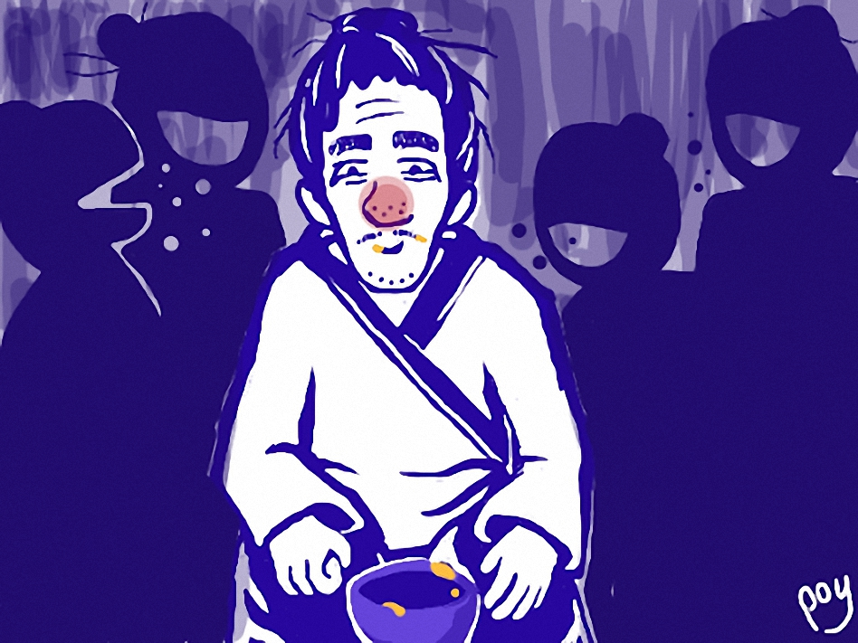

TTTN — Ngũ-vị có ngu ngốc khi từ chối cháo khoai?
==============================================================

Trong năm 2016 này thế giới quan tôi đã chia làm hai phần riêng biệt từ khi đọc được một truyện ngắn và được chứng kiến một sự thật hiển nhiên. Chúng như một cái lẫy nỏ vậy, mà sau cú bắn đã khiến thế giới quan tôi thay đổi rõ rệt như là mũi tên bay ra không thể trở lại.

Phần trước là quãng thời gian từ khi tôi sinh ra đến khi bước vào năm 2016. Tôi thấy trong suốt quãng đời ấy người ta làm với nhau và dạy cho nhau rằng cuộc đời này lý tưởng là giàu có, hay nói cụ thể là thỏa mãn về tứ khoái của con người, càng nhiều càng tốt. Học tập rồi đi làm chỉ là công cụ cho mục tiêu ấy. Tôi không nghi ngờ họ nói dối bởi dường như điều đó đã in sâu vào tư duy nhiều đời. Với riêng Việt Nam thậm chí việc kiếm miếng ăn còn đi vào vô số ca dao.

Lớn lên với mindset ấy tôi đã nghĩ đi làm chỉ là bần cùng bất đắc dĩ. Làm sao để làm càng ít, lương càng cao là tốt. Còn không làm gì mà vẫn có lương là tốt nhất.

Phần sau là quãng thời gian cho đến khi tầm tháng 5 báo chí đăng tin khá dày chuyện Thụy Sĩ trưng cầu dân ý về trợ cấp 2500 USD (50 triệu VNĐ) mỗi tháng cho toàn bộ dân. Tôi đã nghĩ xã hội Utopia không tưởng ấy cuối cùng cũng _sắp_ thành sự thật, kết quả bầu chọn đã rõ. Rồi đến tháng 6 tôi đọc được tin người dân Thụy Sĩ bỏ phiếu _từ chối_.

Cảm xúc lúc ấy của tôi y hệt như khi đọc xong truyện ngắn _Cháo khoai_ của Akutagawa Ryunosuke. Tựa đề bài này lấy cảm hứng từ truyện ấy. Và nó chính là một phần cấu tạo nên cái “lẫy nỏ” của tôi.

_Tóm tắt:_ Nhân vật chính là một gã ngũ-vị họ Mỗ. Tiền bạc không, tư chất không, ngoại hình xấu xí, nói tóm lại chả được cái vị gì. Ngũ-vị thèm ăn cháo khoai lắm mà một năm chỉ được ăn chực một lần. Biết điều này, một Samurai trẻ mời gã về nhà làm bữa cháo khoai đã đời. Ngũ-vị đi ngay. Có điều, khi mâm cháo dọn ra, gã đột nhiên không muốn ăn, và đã _không_ ăn một miếng.

_Nguồn ảnh: Poy_

Ban đầu tôi không hiểu, nhưng sau sự kiện Thụy Sĩ, tôi hiểu ra: Con người ta dù có thấp kém đến thế nào, nhưng muốn vui sống trên đời thì phải có ước mơ. Ước mơ khiến ta có động lực để sáng tạo và tự nâng tầm mình.

> **Trên đời chỉ có hai bi kịch: không có thứ mình muốn và có thứ mình muốn.**
>
> _Oscar Wilde_

Theo Phân tâm học của S. Freud thì mọi sáng tạo đều là thăng hoa từ những ẩn ức tính dục chuyển đổi. Từ đó tôi cũng không lạ khi những tác phẩm văn học kinh điển ra đời từ những văn hào nghèo khổ thay vì những tỉ phú. Akutagawa hiểu điều này, người Thụy Sĩ cũng hiểu điều này. Sự đủ đầy vô điều kiện không những kéo lùi nền kinh tế, mà quan trọng hơn nó sẽ tàn phá ý chí lao động của người dân. Xã hội ấy mà ra đời, nó sẽ là một cái gì đó “trắng xóa”, chỉ ăn, ngủ và chơi như người nguyên thủy. Cái đẹp sẽ không còn, nguồn cội của nghệ thuật cũng không còn. Không có bản nhạc nào ra đời, không kiệt tác nào được vẽ nên và không tác phẩm nào được viết ra nữa.

Và mục tiêu của nhân loại nên là lao động và sáng tạo thay vì thỏa mãn bản năng càng nhiều càng tốt. Bởi vì sự văn minh như ngày nay có được nhờ lao động và sáng tạo.

Điều đáng nói cuối cùng, hồi tháng 5, tôi đọc trên báo những bài phỏng vấn người dân Việt và bản thân cũng có những tranh luận với bạn bè về sự kiện Thụy Sĩ. Dù từ báo hay bạn bè đa số đều không lựa chọn như người dân Thụy Sĩ. Bạn bè tôi có thể phân tích về nền kinh tế Thụy Sĩ sẽ như thế nào, ảnh hưởng đến những nước đang phát triển như Việt Nam ra sao, chứ tuyệt nhiên không nghĩ đến chuyện họ từ chối. Có vẻ như lựa chọn phiếu thuận với người Việt Nam đã là mặc định.

Còn bạn, khi ấy _bạn_ đã chọn gì?

