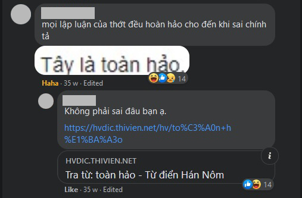

"Tự biết mình" chưa bao giờ là mục đích cho nền giáo dục của chúng ta
==========================================================================================

Trong tiền sảnh Đền thờ Apollo ở Delphi có khắc câu châm ngôn nổi tiếng: **Tự biết mình**. Tự biết mình được cho là tri thức đáng biết đầu tiên của mọi tri thức, nó không chỉ là bước đầu của sự hiểu biết mà còn là thứ dẫn chúng ta xa khỏi những mục đích không phù hợp trong đời; có lẽ chính vì vậy mà câu này thường được gán cho Socrates, một hình mẫu triết gia về cách làm triết học và cách sống triết học.

Giữa hàng tá lùm xùm quanh vấn đề giáo dục ngay khi ngày khai trường mới kết thúc cách đây một tuần, bên cạnh những nghi ngại về chuyện học phí cao hay chuyện sập cổng trường, chúng ta cũng nên đặt nghi ngờ **liệu mô hình giáo dục mà ta thường biết có thật sẽ đáp ứng những kì vọng mà ta thường gửi gắm** hay không.

**Hẳn chúng ta đều thống nhất rằng con người cần phải được giáo dục. Cũng như thống nhất rằng giáo dục nên phát triển mỗi người đi theo đúng tiềm năng của họ**, để họ vừa được theo đuổi những mục tiêu phù hợp với bản thân, để không rơi vào tình trạng con cá học cách trèo cây như câu nói thường gặp, vừa có thể đóng góp giá trị tốt đẹp cho xã hội, và cuộc sống hạnh phúc là kết quả của những cân bằng này.

Mô hình giáo dục ta thường biết: _Trẻ em buộc phải đến trường học, buộc phải học những môn do người khác định sẵn, buộc phải theo những lễ nghĩa người khác đề ra như mặc đồng phục, tuyệt đối im lặng trong giờ học trừ khi được giáo viên cho phép v.v._ Theo Luật Giáo dục 43/2019/QH14, đây là **giáo dục bắt buộc** (phải học bằng cách đến trường, học tại gia chưa được Việt Nam công nhận) và được áp dụng đến hết tiểu học.

Nhưng ta sẽ thấy mô hình giáo dục này không đáp ứng những kì vọng về tự biết mình như ta hằng tưởng.

* * *

## I. LỊCH SỬ GIÁO DỤC THẾ GIỚI

* * *

Giáo dục bắt buộc vốn không phải đặc sản của Việt Nam, nó bắt nguồn từ nhiều nước ở phương Tây, những khảo sát sau đây cho thấy giáo dục bắt buộc và phổ cập ban đầu ra đời với mục đích gì.

Đầu tiên, giáo dục văn hoá vốn là đặc quyền của tầng lớp thượng lưu trong xã hội xưa, là giới quý tộc và giới tăng lữ. Ở Trung Quốc thời nhà Thương, trẻ em quý tộc học lễ nghĩa, âm nhạc, văn chương, trị quốc ở trường do chính phủ mở, còn trẻ em thường dân học ở các trường tư nhân và thực chất chỉ là học nghề như nghề nông hoặc thủ công. \[1\] Ở Ấn Độ cổ đại trẻ em học Kinh Vệ Đà và tầng lớp Bà La Môn được ưu tiên học, ở Trung Quốc từ thế kỉ 13 đến 19 trẻ em học Tam Tự Kinh, loại kinh được thiết kế dễ thuộc để có thể học truyền miệng nếu không biết chữ, tất cả đều phục vụ **mục đích nhồi sọ bằng tôn giáo (hoặc đạo)**.

Tiếp đến nói về giáo dục phổ cập và bắt buộc, thành bang Sparta của Hi Lạp cổ nơi trẻ em 6-7 tuổi phải rời xa mẹ để vào trường học quân sự trong điều kiện tàn bạo, nội dung học là cách chiến đấu và lãnh đạo, dễ thấy **mục đích giáo dục nhằm đào tạo lính phục vụ chiến tranh**. Ở Judea thời cổ đại, mọi trị trấn đều có trường học cho trẻ 6-8 tuổi, giáo viên là người Rabbi, lãnh đạo tinh thần của Do Thái giáo, nội dung học tất nhiên là về Do Thái giáo, **mục đích để hiểu tôn giáo đó**.

Thế kỉ 16 ở châu Âu nổ ra cuộc Cải cách Kháng nghị do Martin Luther khởi xướng. Trong _An die Ratsherren aller Städte deutschen Landes_ (1524) Martin Luther kêu gọi thành lập nền giáo dục bắt buộc để tất cả mọi người đều có thể tự đọc và tự hiểu Kinh Thánh \[2\]. Thánh chế La Mã và Công quốc Württemberg bắt đầu làm theo. Ở Mĩ bộ luật Massachusetts School Laws năm 1647 ra luật mỗi thị trấn có trên 50 hộ dân phải thuê một giáo viên, nếu trên 100 hộ dân phải có một trường học với mục đích tạo ra những người Thanh giáo. Ở Phổ năm 1763 Frederick Đại đế cho ra sắc lệnh tất cả nam nữ 5-14 phải được học về Thiên Chúa giáo, hát Thánh ca, đọc viết theo sách do chính quyền đưa. \[3\] **Như vậy, giáo dục bắt buộc thật sự nở rộ từ sau thế kỉ 16 với mục đích ban đầu là đọc viết, cụ thể là đọc Kinh Thánh**.

Không lâu sau, thế kỉ 18-19 là thời kì của Cách mạng Công nghiệp. Nếu trước đó giáo dục chỉ dừng lại ở đọc viết và tôn giáo, thì nay **ngành công nghiệp đòi hỏi những nhân công làm việc trong điều kiện tẻ nhạt và lặp lại một cách máy móc, họ cần có kỉ luật, biết vâng lời, biết đọc viết ở mức tối thiểu**. Việc giáo dục cũng theo đó mà hãy càng tẻ nhạt, máy móc, càng mang tính thuần phục thì càng tốt.

Nhìn về Việt Nam, những điều này thể hiện qua việc **học sinh phải mặc đồng phục vì không gì cả**, bởi lí do bình đẳng là không đủ thuyết phục khi mà đồ dùng học tập, xe đưa đón toát ra tất cả những chênh lệch giàu nghèo ở gia đình từng em. Và nó càng không đủ thuyết phục khi cố **áp đặt năng lực mọi học sinh theo một hướng** bằng cách ưu tiên môn này là chính, môn kia là phụ, và bằng điểm số khi em này giỏi môn phụ nhưng kém môn chính, như điểm 10 vẽ không thể bằng được điểm 10 toán. Cũng như **học sinh phải tuyệt đối ngồi yên và im lặng trong giờ học bất kể việc im lặng ấy khiến chúng dễ tiếp thu hay khó tiếp thu kiến thức hơn**. Bên cạnh những luật lệ rập khuôn là những bài học về **tổ quốc và tinh thần dân tộc, thứ mà học sinh phải yêu vô điều kiện, phải phẫn nộ và tự hào thay cho nó, mặc dù nó vốn chỉ là một thứ tưởng tượng**.

_Một trong nhiều ý kiến xuất hiện thời buổi nay để phản đối nền giáo dục truyền thống_

Nhìn ra thế giới, không khó để thấy nhiều tác gia và tác phẩm ra đời với thái độ phản đối mô hình giáo dục này. _Bắt trẻ đồng xanh_ của J. D. Salinger với thằng nhóc 16 vừa bị đuổi học Holden Caulfield là phản kháng mạnh mẽ trước những giả tạo và bộ tịch của nền giáo dục và toàn bộ xã hội đối với người trẻ, nhưng tình yêu của Holden với trẻ thơ, cũng như những cư xử của Holden với động vật, lại ngầm hi vọng vào bản chất tốt đẹp của con người khi không bị xã hội tha hoá. _Totto-chan bên cửa số_ muốn nói rằng một đứa trẻ tăng động thay vì đuổi học và cho uống thuốc thì có thể để nó tự học trong môi trường có kiểm soát của người thầy và lớn lên vẫn có cuộc sống hạnh phúc. Và nổi tiếng nhất trong tất cả có lẽ là _Émile hay là về giáo dục_ của J. J. Rousseau mà tôi sẽ trình bày ở phần sau.

* * *

## II. NHỮNG NHƯỢC ĐIỂM CỦA GIÁO DỤC BẮT BUỘC

* * *

Những ý tưởng đầu tiên của những bộ óc vĩ đại về giáo dục bắt buộc hoàn toàn không mang mục đích đàn áp người học. Trái lại nó đầy cao đẹp với mong muốn phổ cập kiến thức cho mọi người với suy nghĩ rằng con người ai cũng có quyền được học, cái họ thiếu chỉ là sách vở, thứ đang bị độc quyền bởi giới thượng lưu bấy giờ.

Tuy nhiên khi ý tưởng này được hiện thực hoá, nó vấp phải nhiều vấn đề hiện thực. Đó là giáo dục có thể trở thành công cụ chính trị, hoặc sự khác biệt ở tiềm năng mỗi người, hoặc những bệnh thành tích và những ảo tưởng nó mang lại cho người học và người dạy.

#### 1\. Giáo dục bắt buộc trở thành công cụ chính trị

Vấn đề đầu tiên là **người học không được quyết định cái gì sẽ nạp vào đầu mình và cái gì thì không**. Tôi vẫn thường thấy những cơn lên đồng tập thể vì những thứ gọi là “Bản sắc dân tộc” như những cơn lên đồng quanh chuyện bánh mì bị người ngoại quốc chê dở, hoặc bún thịt nướng bị giễu bằng cách gọi tục tĩu trong tiếng Pháp (bonne tite noune). Nhưng “Bản sắc Việt Nam” vốn là một thứ tưởng tượng, nó không biết nổi giận để cần người Việt trả thù thay, cũng như trò trêu chọc đó không nhắm vào ai, tại sao cả đám đông phải lên đồng? Trong khi có những cá nhân người Việt khác thì không?

Mặt khác, họ chỉ quanh quẩn nghĩ tới những chuyện trả thù bằng cách kéo nhau chửi rủa người ngoại quốc (để họ càng thêm khinh thường) hoặc lảm nhảm vì thấy nhục và giận, chứ họ không nghĩ được rằng có thể phớt lờ bởi chuyện này vô hại. **Nhưng phương án “Phớt lờ” tuyệt không xuất hiện trong não họ**, bởi họ bị nhồi sọ rằng như vậy là đáng nhục, tư tưởng của họ không được tự do, bởi vốn từ đầu họ không được quyết định cái gì sẽ nạp vào đầu mình.

**Đây chính là hậu quả của những con người không tự biết mình, họ không xác định rõ bản thân là gì, nên theo đuổi những gì, và người khác sẽ xác định giùm họ bằng cách gắn liền bản thân họ với tinh thần dân tộc và những thứ tương tự.** Đáng thương thay, tinh thần dân tộc là thứ vừa dễ bị lợi dụng, cũng vừa là thứ mơ hồ nên những con người đó cả cuộc đời chỉ quanh quẩn với những cơn lên đồng không ngớt.

#### 2\. Giáo dục bắt buộc làm thui chột khả năng tự học

Các nghiên cứu về nhân học cho thấy trẻ em săn bắn hái lượm hiện đại có khả năng tự học rất mạnh mẽ, chúng tự học bằng cách bắt chước người lớn, bằng cách thử và sai. Nghiên cứu cũng cho thấy người lớn không cần dạy chúng nhưng chúng vẫn tự nắm được các kĩ năng săn bắn và vẫn sinh tồn bình thường bằng cách tự học. \[4\]

Nhưng giáo dục bắt buộc vận hành bằng cách bắt người học thụ động nạp vào đầu những kiến thức do người dạy nhồi nhét ít nhất trong 5 năm, và thực tế thường là 12 năm. **Điều này hình thành ở người học cảm giác ghét học, sợ học, thay vì cảm xúc kinh ngạc và vui sướng trước những kiến thức mới mẻ, và đặc biệt là tâm lí luôn trong tình trạng nhìn đâu cũng thấy được hoặc bị dạy đời**.

**Được dạy đời** **ở chỗ** họ lười quan sát và tư duy một mình – đây chính là tự học, thay vào đó họ dễ hoà nhập vào đám đông và tự biến bản thân thành nô lệ tìm chủ nô, những ý kiến của họ là ý kiến về hùa với chủ nô, và từ đó họ trở thành đối tượng mà ngôn ngữ thời buổi nay gọi là “dắt mũi đi như bò”. **Còn bị dạy đời ở chỗ** họ không có khả năng quan sát và chiêm nghiệm một quan điểm trái với định kiến của họ, thay vào đó họ có xu hướng mặc định người đưa quan điểm đang xúi họ phải làm cái gì đó sau khi tiếp nhận quan điểm. Ví dụ ngay bài này, tôi tin là có nhiều con người đang nghĩ tôi xúi họ hãy bỏ học ở trường.

**Đây cũng là hậu quả của không tự biết mình, cạnh đó những con người này có tính tự tin rất thấp**, bởi người tự tin thì không bao giờ lo mình dễ trở thành con rối đến mức hơi tí cũng lo bản thân đang bị dạy đời, và tự trọng thấp đến nỗi nhìn đâu cũng thấy người ta lên mặt dạy mình, dù thực tế không phải.

#### 3\. Giáo dục bắt buộc tạo ra những con người thiếu đam mê

Ở Việt Nam dù có nói thẳng hay không thì vẫn tồn tại tư duy môn chính, môn phụ. Những môn năng khiếu như nhạc, hoạ, thủ công không quan trọng bằng môn chính như toán, văn, ngoại ngữ; do đó những đứa trẻ giỏi nhạc hoạ mà kém toán văn được coi là thấp kém hơn những đứa trẻ ngược lại.

Điều này gây ra hai hệ luỵ, **thứ nhất là những đứa trẻ có tiềm năng ở những môn phụ không được tự tin phát triển, thậm chí bị định hướng để không được phát triển đam mê của mình.** Nó lớn lên với tâm lí bị ức chế khi phải làm lĩnh vực mình không thích, lĩnh vực mình thích thì không làm được vì không có thời gian lẫn quá trình mài giũa, **hay thậm chí không biết mình thích cái gì ngoài những sở thích bản năng như xem sex**.

**Thứ hai là mọi đứa trẻ đều được định hướng theo hướng học thuật, nhưng trí tuệ mỗi người là khác nhau, chỉ có ảo tưởng là giống nhau.** Điều này lí giải cho tôi vì sao có nhiều người lên đồng xung quanh chủ đề tiếng Việt đến thế, một phần do tinh thần dân tộc như trình bày ở mục 1, phần khác chính là do họ **ôm ảo tưởng rằng mình rất giỏi tiếng Việt vì đã được học nó như môn chính** và dùng nó hàng ngày.

Minh hoạ hơi liên quan tí thôi, chèn vào đọc cho vui

Chuyện nực cười này sẽ được giảm nếu mỗi người được học từ nhỏ với đam mê của mình và thôi tự cho rằng mình là chuyên gia của lĩnh vực mình không thích mà chỉ bị nhồi sọ để thích. Một người làm vườn tự tin với kĩ năng trồng trọt của bản thân và tự ý thức khả năng tiếng Việt của mình chỉ ở mức đọc viết tối thiểu, hẳn sẽ không ngông cuồng chửi rủa ông giáo sư ngôn ngữ học trên báo.

**Đấy là nếu như họ tự biết mình.**

Như vậy chúng ta đã thấy giáo dục bắt buộc không những đi xa khỏi những kì vọng về tự biết mình của chúng ta, mà thậm chí nó còn đi ngược lại những kì vọng ấy. **Nhưng nếu giáo dục bắt buộc đã nhiều khuyết điểm như vậy thì tại sao phương tây vẫn phát triển đến thế?**

**Câu trả lời đơn giản là những vĩ nhân trở thành vĩ đại không nhờ nền giáo dục bắt buộc.** Thực vậy, phương tây phát triển mạnh khoa học kĩ thuật từ rất lâu trước khi giáo dục bắt buộc ra đời, và vẫn phát triển sau đó, bởi vì những thành quả này đến từ quá trình tự học và môi trường tự do tri thức. Thành bang Athens được mệnh danh là xứ sở của thiên tài cũng một phần do sở hữu môi trường tự do và đa dạng tri thức. **Bản thân những vĩ nhân ở phương tây cũng mang nhiều mâu thuẫn với nền giáo dục bắt buộc.**

Lưu ý: Giáo dục bắt buộc có nhiều khuyết điểm không đồng nghĩa rằng không giáo dục thì sẽ tốt hơn, và do đó việc hưởng nền giáo dục bắt buộc không tồi tệ hơn tình trạng không được giáo dục gì cả.

* * *

## III. THẾ THÌ NÊN GIÁO DỤC NHƯ THẾ NÀO?

* * *

Mặc dù việc đề xuất mô hình tốt hơn không phải là điều bắt buộc với một bài viết chỉ ra hạn chế của một mô hình khác, nhưng tôi thiết nghĩ sau khi đưa ra bức tranh ảm đạm thì mình cần đề xuất vài gam màu tươi sáng.

_Émile hay là về giáo dục_ là luận văn giáo dục của J. J. Rousseau, công bố năm 1762. Luận văn gồm năm quyển này gây chấn động vì tư tưởng tiến bộ đối với thời bấy giờ, mà thậm chí cả ngày nay, khi **triết lí giáo dục của ông đặt người học làm trung tâm, thay vì người dạy.** **Rousseau kịch liệt chống lại nền giáo dục biến con người trở thành công cụ để phục vụ xã hội, ông cho rằng giáo dục phải là nơi để con người được sống với thiên chân của mình, sống trung thực với bản thân và tự biết mình sâu sắc**.

**Nhưng không có nghĩa rằng Rousseau ủng hộ sống theo bản năng, ông đòi hỏi điểm cân bằng giữa sự phát triển tự nhiên và sự thúc đẩy những điểm mạnh trong đứa trẻ.** Điều này đòi hỏi một người thầy phải rất hiểu và rất giỏi về thiên chân của con người, đồng thời đòi hỏi một môi trường tách xa những định kiến xã hội nhưng cũng không phải là rừng rú nơi sống theo bản năng. Môi trường giáo dục này tất nhiên cũng người thầy giỏi kia thiết kế. Và việc học sẽ đến theo nhu cầu của đứa trẻ trong khi nó một mình trải nghiệm cuộc sống, để cho đứa trẻ tưởng rằng nó và chỉ mình nó hình thành ham muốn học sự này, dù thực chất sự học đó ít nhiều có ảnh hưởng gián tiếp từ người thầy.

Sản phẩm của nền giáo dục đó sẽ là một con người mà trước hết **biết cách làm người**, có lí tính, tự biết mình. Và hệ quả tất yếu là con người đó phải sống trong cộng đồng vì bản năng chúng ta là động vật bầy đàn. Khi đã sống trong cộng đồng thì tất nhiên con người đó phải lao động dưới hình thức nào đó để xây dựng xã hội và nuôi sống bản thân. **Nhưng cốt lõi là dù y làm nghề gì thì trước tiên y phải biết làm người, chứ không làm công cụ cho một hệ thống nào đó.** \[5\]

Những suy tư của Rousseau không hoàn toàn là lí tưởng viển vông, hơn 200 năm sau bằng cách nào đó đã xuất hiện một mô hình giáo dục mang nhiều tương đồng với những gì ông viết. Tôi đang nói đến trường Sudbury Valley, theo tôi tìm hiểu thì họ không nhắc đến Rousseau nhưng quả thật có rất nhiều điểm giống nhau.

Sudbury Valley đã đang tồn tại được 50 năm ở bang Massachusetts, Mĩ. Triết lí giáo dục của họ là trẻ em tự có khả năng chọn thứ mình học, thậm chí tự học mà không cần người dạy. **Trẻ em chỉ thiếu kinh nghiệm và học liệu mà thôi, và người lớn chỉ có nhiệm vụ cung cấp hai điều này nếu được trẻ em yêu cầu.** Ví dụ như sẽ mở khoá học khi được yêu cầu, có những học sinh không theo bất kì khoá học nào cũng không sao, những học sinh đó tiếp tục vui chơi trong phạm vi trường, và tự học qua những trò chơi. Ở Sudbury Valley không có nạn bắt nạt học đường.

Ngôi trường này không có giáo viên mà chỉ có nhân viên giữ vị trí như người lớn hỗ trợ trẻ em. Nội quy trong trường cũng do học sinh soạn thảo và thống nhất với nhau, miễn không vi phạm pháp luật. Bản thân những người lớn, hay còn gọi là nhân viên trường, có thời hạn hợp đồng một năm, gia hạn công tác thông qua cuộc bỏ phiếu kín của học sinh. Những nhân viên trường đóng vai trò như người lớn trong cộng đồng, điều đó đồng nghĩa với tấm gương cho trẻ em noi theo, vì bắt chước là bản năng của chúng ta.

**Theo nghiên cứu và báo cáo của Peter Gray, học sinh tốt nghiệp từ Sudbury Valley xuất hiện trong tất cả ngành nghề**: thợ thủ công, doanh nhân, nghệ sĩ, bác sĩ. Những học sinh tiếp tục học lên đại học và cao đẳng đều không gặp khó khăn, số khác có thể đi làm và sinh sống mà không học đại học. \[6\] **Một bài báo trên The Atlantic cho biết học sinh ở Sudbury Valley nảy sinh ham muốn học đọc viết từ những trò chơi về chữ**, hay như một trường hợp có học sinh mặc áo in chữ Vạn (biểu tượng của Đức quốc xã) đã bị nhiều học sinh khác phản đối, cuối cùng dấy lên tranh luận nhằm đưa vấn đề này vào nội quy, **cuộc tranh luận đó kích thích ham muốn học tập của học sinh, và người lớn trong cộng đồng sẽ hỗ trợ trẻ em về việc học**. \[7\]

Ở đây tôi chưa dám mạnh miệng khẳng định mô hình Sudbury tốt hơn mô hình cũ, bởi số trường học và số học sinh Sudbury vẫn còn quá ít để so sánh. Mô hình trường Sudbury vẫn còn chưa phổ biến ngay cả với người Mĩ. Tuy nhiên Sudbury đã thành công ở việc làm mô hình giáo dục thay thế và chưa thấy tác hại nào, trong khi mặt lợi của nó là cho học sinh niềm vui khi học.

**Cuối cùng, sẽ có nghi ngại rằng nếu để con người tự do chọn môn học thì dẫn đến nhiều người mù tịt thông tin về khoa học và y học cơ bản – những thứ ảnh hưởng đến tính mạng cộng đồng, mà ví dụ điển hình là phong trào antivax.** Tuy nhiên, sẽ là vội vàng nếu đổ tất cả lỗi vào giáo dục tự do cho nguyên nhân ra đời antivax. Antivax đã xuất hiện từ thế kỉ 19 khi mọi người phản đối tiêm chủng đậu mùa. Mặt khác, thống kê cho thấy những người antivax mạnh mẽ nhất lại là những người có học, sống ở thành thị, kinh tế từ khá trở lên. \[8\] Có nghĩa rằng không phải họ antivax vì họ dốt nát, mà họ antivax vì nghi ngờ giới khoa học và nền y tế. **Đây không phải vấn đề kiến thức mà là vấn đề đổ vỡ niềm tin vào giới chuyên môn**.

Từ xưa đến nay việc thu phục lòng người cho muôn người như một vẫn luôn là bài toán nan giải. Nói thế cũng có nghĩa là chúng ta phải sống chung với những người antivax, vì suốt cả bài này đã cốt để cho thấy **tầm nhận thức lẫn niềm tin của mỗi người là khác nhau.** **Việc cố gắng cho tất cả con người cùng nhất loạt tuân theo điều gì đó, dù điều đó là đúng đi nữa, vô hình trung đã đi ngược tinh thần bài này.** Nhưng thực tế sẽ không quá bi đát bởi bên cạnh những người antivax, chúng ta có lại những nhà khoa học miệt mài tìm ra vắc-xin, chính họ mới là người thay đổi thế giới, và để có những người lỗi lạc thì càng thêm cần một nền giáo dục tự do, nơi người học không bị nhồi nhét lễ nghĩa và kiến thức không phù hợp, mà được tiếp thu kiến thức mình yêu thích trong vui sướng lẫn trong kinh ngạc.

* * *

\[1\] Education in Post-Mao China, Jing Lin.

\[2\] Luther deutsch, Martin Luther, trang 70.

\[3\] Absolutism and the Eighteenth-Century Origins of Compulsory Schooling in Prussia and Austria, James van Horn Melton, trang 14.

\[5\] Émile hay là về giáo dục, J. J. Rousseau, Lê Hồng Sâm và Trần Quốc Dương dịch, NXB Tri Thức, 2008.

* * *

**TORNAD**

12/9/2020

