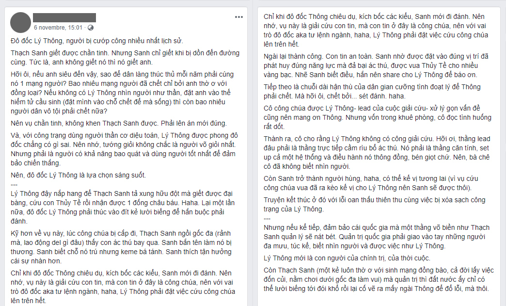
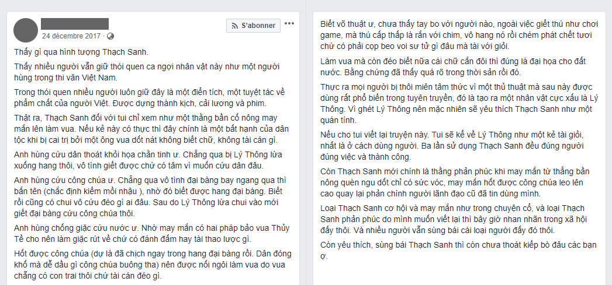
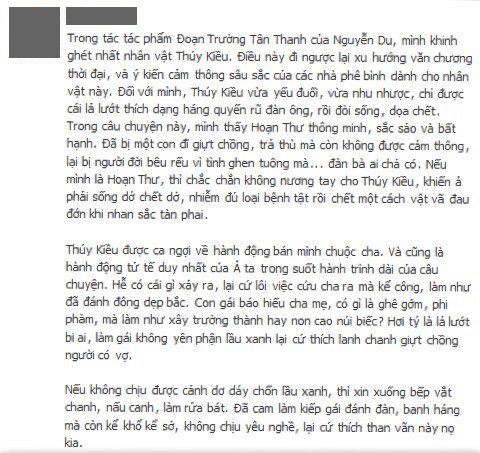
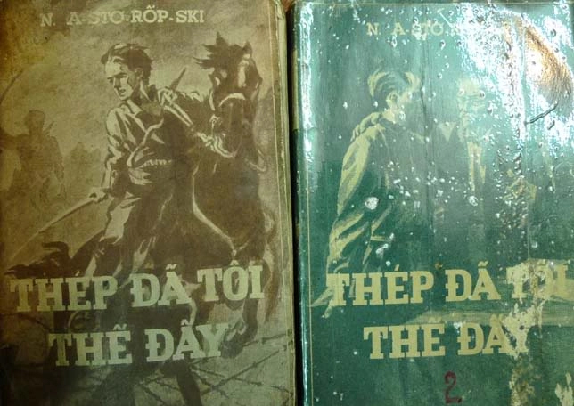
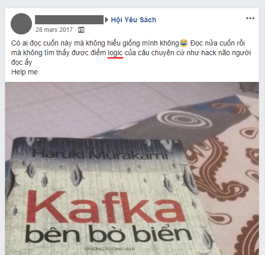
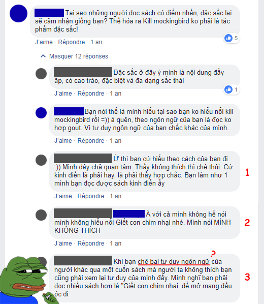
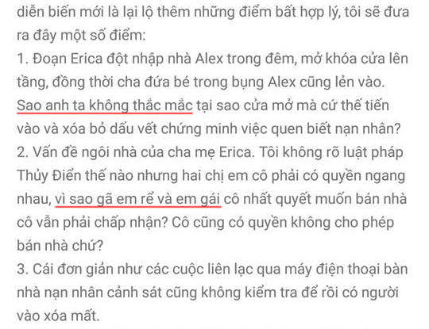

Văn học hiện thực và những ca ngộ độc tinh thần
================================================================

Giới phê bình gia facebook gần đây có những cuộc xét lại văn học rất ngoạn mục. Từ những tác phẩm văn học bác học như _Truyện Kiều_, cho đến văn học dân gian như _Thạch Sanh_, tất cả đều được mang ra xét lại theo cách cảm nhận mới, đánh giá mới, góc nhìn mới.

Nếu như ở _Truyện Kiều_, trường phái phê bình facebook cho rằng **Kiều chỉ là một con đĩ yếu đuối, Truyện Kiều ca ngợi một cá nhân suy đồi**; thì _Thạch Sanh_ được cho rằng là **câu chuyện của một bần nông gặp may, một kẻ dốt nát võ biền không xứng đáng làm vua**. Ta thấy những nhận định ấy đều đi theo hướng hiện thực. Kiểu phê bình tương tự như vậy được áp dụng ở khá nhiều tác phẩm khác.

Hình 1

Hình 2

Hình 3

Có nhiều nguyên nhân cho những bài nhận định như trên. Do não trạng phản kháng lại những thứ được nhồi nhét khi còn học ngữ văn thời phổ thông (hình 1), do ghét những chiêu tuyên truyền của chính quyền đến mức ám ảnh (hình 2), do ẩn ức chống đối những phê bình gia chính thống (hình 3).

Nhưng trớ trêu thay, tất thảy phản kháng trên lại đều đang dùng chính phương cách mà chương trình ngữ văn phổ thông, hoặc nói cách khác là công cụ của chính quyền, nhồi nhét vào đầu họ: **Đó là chủ nghĩa văn học hiện thực (literary realism).**

* * *

## CHỦ NGHĨA HIỆN THỰC LÀ GÌ?

* * *

**Chủ nghĩa hiện thực** là một phong trào nghệ thuật lấy thực tế đời sống làm chủ trương sáng tác. Chủ nghĩa hiện thực mong muốn tái dựng chân thực mối quan hệ giữa con người và xã hội. Trong văn học, tuy các nguyên tắc đã xuất hiện từ thời Cổ Đại cho đến Khai Sáng, nhưng chỉ đến đầu thế kỉ 19 chủ nghĩa hiện thực mới được định danh tại các nước châu Âu như Pháp, Anh.

Ta cần phải hiểu bối cảnh lúc bấy giờ rằng: **Chủ nghĩa hiện thực** ra đời trong sự phản kháng chủ nghĩa lãng mạn, **chủ nghĩa lãng mạn** lại ra đời trong sự phản kháng **chủ nghĩa cổ điển**. Trong khi chủ nghĩa cổ điển được kế thừa tinh thần Phục Hưng và tính duy lí của triết học Descartes, thì chủ nghĩa lãng mạn lại không tôn thờ lí trí như thế mà hướng tới tự do và trực giác, đề cao tính sáng tạo của nghệ sĩ, bác bỏ tư tưởng “nghệ thuật là mô phỏng tự nhiên” được đề ra từ thời Aristotle. Sau đó là đến chủ nghĩa hiện thực, như giới thiệu bên trên, nghệ thuật lúc này được kéo sát vào đời sống, phản ánh trung thành xã hội.

Tôi kể ra bối cảnh trên mục đích chỉ ra rằng **để nhìn nhận được đúng đắn chủ nghĩa phía sau, ta buộc phải có kiến thức về các chủ nghĩa phía trước góp phần sinh ra nó, nếu không thì mọi nhìn nhận và theo đuổi đều là biến tướng và xô lệch**.

Văn học hiện thực Mĩ những năm 1880 đây, sớm được dịch so với các thể loại khác nhiều (Nguồn ảnh: sachxua)

**Về chủ nghĩa cổ điển** theo nghĩa là phong trào nghệ thuật và khuynh hướng mĩ học của nó vào thế kỉ 18-19, thì ở Việt Nam chưa bao giờ xuất hiện.

**Về chủ nghĩa lãng mạn**, ở Việt Nam xuất hiện vào những năm 30 của thế kỉ 20 với những cây viết Tự lực văn đoàn và phong trào Thơ mới.

**Về chủ nghĩa hiện thực**, khỏi phải nói, ở Việt Nam xuất hiện _bạt ngàn và ngồn ngộn_ hiện thực, chính xác hơn là hiện thực phê phán, vào những năm 30-45 của thế kỉ 20, với Nam Cao, Vũ Trọng Phụng…

Thời đó, những năm 1935-1939 đã nổ ra **cuộc bút chiến giữa Nghệ thuật vị nghệ thuật do Hoài Thanh đại diện và Nghệ thuật vị nhân sinh** **do Hải Triều đại diện**. Phần thắng nghiêng về phái Vị nhân sinh, đi cùng nó là công việc tuyên truyền lí luận Mác-xít phục vụ mục đích chính trị. Từ hiện thực phê phán, sau này có cả **hiện thực xã hội chủ nghĩa** (socialist realism) sinh ra và phát triển ở Liên Xô. Ở Việt Nam quyển “sách gối đầu giường” _Thép đã tôi thế đấy_ chính là dấu vết của nó.

Vâng, như vậy đứng sau cuộc bút chiến không gì khác là cả bầu trời mưu đồ chính trị. Kéo theo sau là sự áp đảo của văn học hiện thực trong xã hội và trong trường học cho đến tận ngày nay, như chúng ta đã biết.

Văn học hiện thực xã hội chủ nghĩa Liên Xô đây, quyển này thì còn sớm nữa (Nguồn ảnh: sachxua)

Có thể thấy chủ nghĩa hiện thực đi vào Việt Nam bị **thiếu cái nền tảng** chủ nghĩa cổ điển, thậm chí còn không trải qua dư thừa chủ nghĩa lãng mạn để tạo đòn bẩy đi lên hiện thực. Chủ nghĩa hiện thực lúc bấy giờ là **đầu thừa đuôi thẹo**. Nó vào và sống khoẻ được ở Việt Nam vì 2 lẽ:

**1\. Thích hợp với đường lối chính trị.** Yếu tố _hiện thực_ phù hợp với khả năng tiếp thu của nhân dân; _phê phán_ phù hợp với mục đích lên án Pháp-Nhật và cường hào ác bá; sau lại đẻ ra _hiện thực chủ nghĩa xã hội_ để tuyên truyền cách mạng, thôi thì lúc này nó hoàn hảo rồi.

**2\. Thích hợp với tư duy nhân dân.** Để đọc văn học hiện thực, người ta _không cần biết_ về các khuynh hướng mĩ học và ước lượng và đầy lí tính như chủ nghĩa cổ điển – thứ vốn dành cho tầng lớp ưu tú. Người ta cũng _khó lòng đồng điệu được_ như với chủ nghĩa lãng mạn, khi mà bụng chưa no, chữ chưa nhiều, ai mà quan tâm nổi đến sáng tạo với cá tính với trực giác?

Thảy họ cần là một **thứ nghệ thuật dễ hiểu** _(tức là biết đọc/biết nghe là hiểu được, chứ không phải cần học một đống tư tưởng mới hiểu)_ và **hữu dụng** _(như lên án kẻ họ ghét cho thoả dạ)_. Nghệ thuật vị nghệ thuật với tư tưởng nổi tiếng “nghệ thuật là vô dụng”\[1\] không phù hợp ở đây, Nghệ thuật vị nhân sinh phù hợp hơn nhiều.

Tôi viết đoạn trên cốt cho thấy **khuynh hướng phân tích mọi thứ theo góc độ hiện thực là khuynh hướng của người ít học và bản năng**. Ngạn ngữ tây có câu: _“Nếu thảy bạn có là búa, thì thảy bạn thấy là đinh.”_ Con người lí giải mọi thông tin đi vào bằng vốn kiến thức mình có, hiển nhiên nếu vốn kiến thức nghèo nàn thì người ta dễ lí giải một cách gắng gượng và không khớp.

Người ít học phân tích mọi thứ theo góc độ hiện thực là dễ hiểu thôi. **Hiện thực là thứ ai cũng có, và nếu đó là thứ duy nhất họ có thì họ sẽ nhìn mọi nghệ phẩm theo góc độ ấy.**

* * *

## VÀ THẾ THÌ NGỘ ĐỘC NHƯ THẾ NÀO?

* * *

Ngộ độc hiện thực thì chủ nghĩa hiện thực ở đây ta phải hiểu là **thứ du nhập đầu thừa đuôi thẹo chứ không phải chủ nghĩa hiện thực có bài bản**.

Thử trông các ảnh:

Lô-gích?

_Quyển này không lô-gích, quyển kia rất lô-gích._ Thực chất lô-gích ở đây là **một cách nói thời thượng của sự hợp với thực tế xã hội**, chứ tuyệt nhiên không theo khái niệm lô-gích trong môn lô-gích học cùng những qui tắc của nó. Hiếm có rồ-trinh thám nào dù miệng bảo đọc trinh thám để rèn lô-gích mà trong đầu lại biết đến những qui tắc cơ bản của lô-gích học cả.

**Đó chỉ là một cách nói thời thượng của sự hợp với thực tế xã hội.** Nghĩa là khi anh giết người, anh hoặc bày mưu trốn cảnh sát thành công, hoặc anh bị bắt và đền tội; _đó là lô-gích_, vì xã hội này coi giết người là tội ác. Còn nếu khi anh giết người, anh chụp xeo-phi gửi cho cảnh sát, cảnh sát tặng anh huy chương cùng lời khen ngợi; _đó là phi lô-gích_, vì chuyện này không bình thường trong xã hội thực.

Thảy là vậy, không có cách hiểu nào khác cho thứ lô-gích này. Thu thập dữ kiện trong truyện rồi đoán hung thủ giùm Sherlock Holmes ư? Không thể nào vì dữ kiện là thứ vô hạn tuỳ sáng tác của tác giả, và kết quả lại tuỳ vào số lượng dữ kiện. **Ví dụ:** có 10 dữ kiện, 6 trong số đó cho thấy A là hung thủ. _Quá bán rồi, lô-gích?_ Nhưng chỉ cần 3 trang sau tác giả viết thêm 20 dữ kiện, cả 20 dữ kiện này đều cho thấy B mới là hung thủ. 20 > 6, vậy B là hung thủ. _Vẫn lô-gích?_

Đấy là trong truyện, còn ngoài đời dữ kiện phức tạp, tâm lí tội phạm lại phức tạp hơn nhiều. **Cái gọi là suy đoán thực chất dựa vào kinh nghiệm, chứ không phải lô-gích.**

Và hiện tượng trên, nguyên nhân sâu xa chính là ngộ độc hiện thực vậy.

Ba lần giãy đành đạch của Bạch Cốt Tinh

Ngộ độc hiện thực thứ hai là não trạng **tôn thờ tình tiết truyện**(nhưng tình tiết phải bám sát hiện thực thì mới cho là lô-gích, là hay). Với bộ phận độc giả ít học thì văn chương chỉ có hai yếu tố: **Văn có mượt không, và nội dung có hấp dẫn không.**

**1\. Văn mượt** ở đây tức là cách viết/nói có quen thuộc với cách họ nghe/nói trong đời thường hay không để từ đó thấy dễ hiểu hay không (chứ chẳng phải là các _thủ pháp_ hay _chức năng_ ở _tính văn chương_). Có thể nói là càng viết dân dã theo đời thường thì càng mượt.

**2\. Nội dung hấp dẫn** ở đây chính là sự giật gân, li kì, tréo ngoe. Bởi vì cuộc sống thường ngày vốn đều đều, thỉnh thoảng có đánh nhau lột đồ thì mới hấp dẫn, và cái hấp dẫn thì mới đáng viết thành truyện, chứ viết truyện từ đầu đến cuối chỉ tâm sự với miêu tả cuộc sống bình lặng thì cuộc sống tôi cũng có thừa, còn hấp dẫn nỗi gì? Ấy chính là suy nghĩ của họ.

Chỉ là vài câu hỏi nhảm của những thứ gọi là "đọc trinh thám để rèn lô-gích"

**Nhưng tất nhiên với người có học thì văn chương không bao giờ nghèo nàn đến thế.** Có nhiều trường phái phê bình văn học mang mong muốn cảm thụ văn chương ở những chiều kích khác. Một vài trong số đó là:

**1\. Hình thức luận (formalism):** trường phái phê bình tập trung duy nhất vào văn bản, đối tượng nghiên cứu là _tính văn chương_, bao gồm các _thủ pháp_ và các _chức năng_. Đối với hình thức luận, **nội dung chỉ là thứ yếu so với hình thức**. Ngoài ra, hình thức luận **phớt lờ các mặt ý nghĩa** trong tác phẩm, với các nhà hình thức luận thì _tài năng nghệ sĩ nằm trong việc sử dụng ngôn từ chứ không phải thái độ hay tư tưởng của họ trước cuộc sống_.

Trở lại các ví dụ ở đầu bài, thì trường phái này chính xác để dành cho _Truyện Kiều_ của Nguyễn Du. Nội dung mượn của tàu? Không quan trọng! Cái lí do để người đời ca tụng Truyện Kiều nằm ở những câu thơ **khuôn vàng thước ngọc** của Nguyễn Du kìa.

Xa xa ở trời tây có Oscar Wilde với _Bức hoạ Dorian Gray_ cũng nên được dùng với trường phái này. Ý tưởng bán linh hồn cho quỉ chả có gì đặc sắc, _Faust_ của Goethe đã có trước. Ý tưởng có linh hồn ngụ trong bức tranh vẽ cũng không lạ, _Bức chân dung_ của Nikolai Gogol đã đề cập. Nhưng người ta tôn thờ Wilde đơn giản vì **văn hay chữ tốt**.

**2\. Cấu trúc luận (structuralism):** với trường phái này, nghiên cứu văn học là một phần nhỏ của giải mã các _biểu tượng_ của hệ thống kí hiệu học rộng lớn. Mỗi biểu tượng được kết hợp bằng hai mặt: _cái biểu đạt_ và _cái được biểu đạt_. Kí hiệu học hoàn chỉnh đến mức không còn chỉ được áp dụng trong văn học mà còn ở rất nhiều lĩnh vực khác.

Với ví dụ đầu bài, ta có thể nhìn thấy trong _Giết con chim nhại_ biểu tượng _chim nhại_. Ở đây cái biểu hiện là chim nhại, cái được biểu hiện là những con người lương thiện và vô hại. Giết con chim nhại được hiểu như hành động hãm hại những con người lương thiện và vô hại ấy.

**3\.** **Và nhiều trường phái khác v.v…** (Tuy nhiên tôi chưa từng thấy trường phái nào phê bình về tính hợp lí trong nội dung tác phẩm cả.)

* * *

## KẾT

* * *

Nhìn chung, tôi không phủ nhận cách giảng dạy trong nhà trường cứ buộc học sinh phải khen Thuý Kiều thế này, khen Thạch Sanh thế kia là lối dạy bảo thủ và tù túng. Nhưng cách phản kháng như dẫn chứng trên đầu bài, dù biết là cố viết nhảm gây cười, là rất ngu si và thể hiện tâm hồn bị đầu độc vì văn học hiện thực. Cạnh đó, chứng ngộ độc này ảnh hưởng đến cách cảm thụ các tác phẩm khác không viết theo lối hiện thực.

Nếu cứ tình trạng này chắc các sách giáo khoa nên bỏ hết tác phẩm văn chương ra mà thay vào bằng **trinh thám** và sách **dạy làm giàu**. Ngữ văn cấp 1 nên dạy trinh thám kinh dị, cấp 2 dạy _Đắc nhân tâm_, cấp 3 dạy _Hút cần cùng Tony_ cho vừa **hợp gu** lại vừa **hữu dụng** với các bạn trẻ.

* * *

**Chú thích:**

**Tham khảo:**

* * *

**Tornad**

19/11/2018

